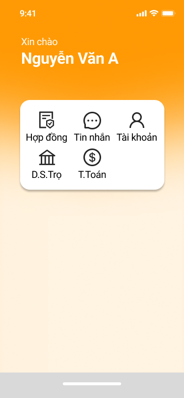
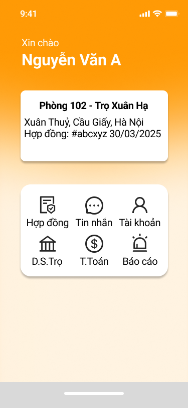

# SmartTrọ — Home Screen Living Specification

## 1. Thông tin tài liệu

| Thuộc tính | Giá trị |
| --- | --- |
| Sản phẩm | SmartTrọ |
| Màn hình | Home |
| Parent task | `GLI-69` |
| Trạng thái | Draft — chờ PO review |
| Ngày cập nhật | 2026-09-30 |
| Thứ tự triển khai | Docs → FE UI/review → đánh giá BE → Integration → QA → UAT |

Tài liệu này mô tả màn Home của người thuê trọ. Đây là **màn tổng hợp và điều hướng**, không phải Use Case độc lập và không thay thế các UC nghiệp vụ đích.

## 2. Mục tiêu

- Chào người dùng đã đăng nhập và hiển thị đúng tên hiển thị.
- Cho người dùng truy cập nhanh các chức năng chính của SmartTrọ.
- Khi người dùng có hợp đồng active, hiển thị tóm tắt hợp đồng hiện tại và mở thêm lối vào `Báo cáo`.
- Khi không có hợp đồng active, không hiển thị thẻ hợp đồng và không hiển thị `Báo cáo`.

## 3. Phạm vi đã chốt

### 3.1 Trong phạm vi

- Hai trạng thái Home:
  1. Người thuê **không có hợp đồng active**.
  2. Người thuê **có hợp đồng active**.
- Khối chào mừng gồm `Xin chào` và tên hiển thị của người dùng.
- Các nút điều hướng theo đúng trạng thái.
- Thẻ tóm tắt hợp đồng active ở trạng thái có hợp đồng.
- Loading, empty, error và session-expired cần được đặc tả trước khi handoff implementation.
- FE phải dựng UI trước khi quyết định chi tiết BE/API.

### 3.2 Ngoài phạm vi

- Danh sách nhà trọ/phòng trọ.
- Tìm kiếm, lọc, đề xuất, yêu thích hoặc xem chi tiết phòng.
- Dữ liệu phòng đang available theo từng trọ.
- Nội dung các màn Hợp đồng, Tin nhắn, Tài khoản, Danh sách Trọ, Thanh toán hoặc Báo cáo.
- Thay đổi nghiệp vụ của `GLI-17 — Renter room discovery and detail`.

`D.S.Trọ` trong Home chỉ là **nút điều hướng**. Màn đích hiển thị danh sách trọ và các phòng đang available tương ứng với từng trọ là phạm vi riêng, chưa được triển khai trong parent Home này.

## 4. Nguồn thiết kế

### 4.1 Không có hợp đồng active

- Kích thước capture: `375 × 812`.
- Không có thẻ tóm tắt hợp đồng.
- Có 5 nút: `Hợp đồng`, `Tin nhắn`, `Tài khoản`, `D.S.Trọ`, `T.Toán`.
- Không hiển thị `Báo cáo`.

### 4.2 Có hợp đồng active

- Kích thước capture: `375 × 812`.
- Có thẻ tóm tắt hợp đồng active.
- Có 6 nút: `Hợp đồng`, `Tin nhắn`, `Tài khoản`, `D.S.Trọ`, `T.Toán`, `Báo cáo`.

Capture là nguồn đối chiếu bố cục. FE vẫn phải dùng token, font, icon asset và component convention đã được chốt trong code; không hard-code theo pixel nếu làm hỏng responsive hoặc accessibility.

## 5. Thành phần và dữ liệu

### 5.1 Khối chào mừng

| Trường | Quy tắc |
| --- | --- |
| Nhãn | `Xin chào` |
| Tên | Tên hiển thị của tài khoản đã đăng nhập |
| Fallback | Cần được PO chốt trước handoff nếu tên hiển thị rỗng |

### 5.2 Thẻ tóm tắt hợp đồng active

Chỉ hiển thị khi backend xác nhận có hợp đồng active phù hợp với tài khoản hiện tại.

| Trường | Ví dụ từ mockup | Ghi chú |
| --- | --- | --- |
| Phòng và nhà trọ | `Phòng 102 - Trọ Xuân Hạ` | Một dòng ưu tiên; xử lý overflow theo UI spec |
| Địa chỉ | `Xuân Thủy, Cầu Giấy, Hà Nội` | Có thể xuống dòng |
| Hợp đồng | `Hợp đồng: #abcyz 30/03/2025` | Cần chốt ý nghĩa ngày trước khi API contract được duyệt |

Không đưa danh sách phòng, giá thuê, đề xuất phòng hoặc CTA tìm phòng vào thẻ này.

### 5.3 Khối điều hướng

| Hành động | Không có HĐ active | Có HĐ active | Phạm vi Home |
| --- | --- | --- | --- |
| Hợp đồng | Có | Có | Điều hướng |
| Tin nhắn | Có | Có | Điều hướng |
| Tài khoản | Có | Có | Điều hướng |
| D.S.Trọ | Có | Có | Điều hướng; màn đích ngoài scope |
| T.Toán | Có | Có | Điều hướng |
| Báo cáo | Không | Có | Điều hướng |

Không hiển thị nút disabled thay cho `Báo cáo` ở trạng thái không có hợp đồng; nút này được ẩn theo mockup.

## 6. Luồng chính

1. Người dùng đã đăng nhập mở app hoặc điều hướng về Home.
2. FE hiển thị loading state không làm nhảy layout bất thường.
3. Hệ thống lấy profile tối thiểu và trạng thái hợp đồng active.
4. Nếu không có hợp đồng active, hiển thị Home 5 nút.
5. Nếu có hợp đồng active, hiển thị thẻ tóm tắt và Home 6 nút.
6. Khi người dùng chọn một nút, app điều hướng tới màn/flow tương ứng; Home không tự thực thi nghiệp vụ của màn đích.

## 7. Acceptance Criteria

### AC-HOME-01 — Không có hợp đồng active

- **Given** người dùng đã đăng nhập và không có hợp đồng active
- **When** Home tải thành công
- **Then** màn hình hiển thị lời chào, tên người dùng và đúng 5 hành động `Hợp đồng`, `Tin nhắn`, `Tài khoản`, `D.S.Trọ`, `T.Toán`
- **And** không hiển thị thẻ hợp đồng hoặc nút `Báo cáo`.

### AC-HOME-02 — Có hợp đồng active

- **Given** người dùng đã đăng nhập và có hợp đồng active
- **When** Home tải thành công
- **Then** màn hình hiển thị lời chào, tên người dùng, thẻ tóm tắt hợp đồng và đúng 6 hành động theo mockup
- **And** thông tin hợp đồng thuộc tài khoản hiện tại.

### AC-HOME-03 — D.S.Trọ chỉ điều hướng

- **Given** người dùng đang ở Home
- **When** người dùng chọn `D.S.Trọ`
- **Then** app điều hướng tới route của danh sách trọ/phòng
- **And** Home không tự tải hoặc render danh sách trọ, phòng, tìm kiếm hay đề xuất.

### AC-HOME-04 — Session hết hạn

- **Given** session không còn hợp lệ
- **When** Home cần dữ liệu bảo vệ
- **Then** app thực hiện behavior session-expired dùng chung của SmartTrọ
- **And** không hiển thị dữ liệu hợp đồng cũ của người dùng trước đó.

### AC-HOME-05 — Responsive và thiết bị

- **Given** build được chạy trên các viewport/device đã duyệt
- **When** Home được render
- **Then** nội dung không bị cắt, chồng lấn hoặc tràn khỏi safe area
- **And** thứ tự điều hướng, trạng thái có/không hợp đồng và hierarchy thị giác vẫn đúng với mockup.

## 8. Điểm cần PO chốt trước handoff

| ID | Câu hỏi | Lý do |
| --- | --- | --- |
| `HOME-Q01` | Nếu một người dùng có hơn một hợp đồng active thì thẻ Home chọn hợp đồng nào hay chuyển thành danh sách? | Mockup chỉ thể hiện một hợp đồng. Không được để Dev tự suy diễn. |
| `HOME-Q02` | Ngày trong dòng `Hợp đồng: #... dd/mm/yyyy` là ngày bắt đầu, ngày ký hay ngày hết hạn? | Cần contract dữ liệu và nhãn chính xác. |
| `HOME-Q03` | Fallback khi profile chưa có tên hiển thị là gì? | Tránh hiển thị trống hoặc email ngoài ý muốn. |
| `HOME-Q04` | Error/offline state có giữ navigation tĩnh và ẩn thẻ hợp đồng hay hiển thị retry toàn màn? | Ảnh hiện chưa có state lỗi. |

## 9. Gate triển khai

1. PO review tài liệu này và trả lời các câu hỏi mở.
2. PM cập nhật task DOCS và chỉ sau đó mới giao FE.
3. FE dựng đủ hai trạng thái bằng dữ liệu mock và có Android/web evidence.
4. PO review UI.
5. BE chỉ triển khai dữ liệu profile/contract summary thực sự cần; không mở rộng sang discovery.
6. Integration → QA → UAT.
