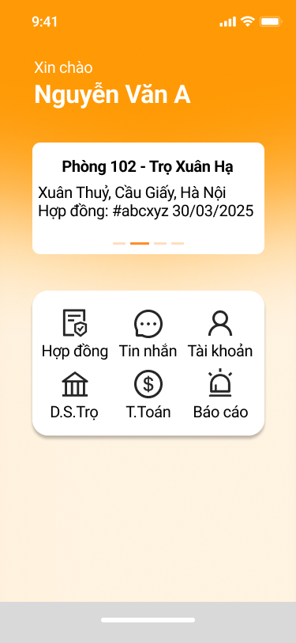

# SmartTrọ — Home Screen Living Specification

## 1. Thông tin tài liệu

| Thuộc tính | Giá trị |
| --- | --- |
| Sản phẩm | SmartTrọ |
| Màn hình | Home |
| Parent task | `GLI-69` |
| Trạng thái | Approved — PO chốt ngày 2026-10-02 |
| Ngày cập nhật | 2026-10-02 |
| Thứ tự triển khai | Docs → FE UI/review → đánh giá BE → Integration → QA → UAT |

Tài liệu này mô tả màn Home của người thuê trọ. Đây là **màn tổng hợp và điều hướng**, không phải Use Case độc lập và không thay thế các UC nghiệp vụ đích.

## 2. Mục tiêu

- Chào người dùng đã đăng nhập và hiển thị đúng tên hiển thị.
- Cho người dùng truy cập nhanh các chức năng chính của SmartTrọ.
- Khi người dùng có hợp đồng active, hiển thị tóm tắt hợp đồng hiện tại và mở thêm lối vào `Báo cáo`.
- Khi không có hợp đồng active, không hiển thị thẻ hợp đồng và không hiển thị `Báo cáo`.

## 3. Phạm vi PO đã chốt

### 3.1 Trong phạm vi

- Hai trạng thái nghiệp vụ chính của Home:
  1. Người thuê **không có hợp đồng active**.
  2. Người thuê **có ít nhất một hợp đồng active**; một hợp đồng hiển thị một card, nhiều hợp đồng hiển thị carousel card.
- Khối chào mừng gồm `Xin chào` và tên hiển thị của người dùng.
- Các nút điều hướng theo đúng trạng thái.
- Thẻ hoặc carousel tóm tắt hợp đồng active ở trạng thái có hợp đồng.
- Loading, retry, error, offline và session-expired theo quy tắc tại tài liệu này.
- FE phải dựng UI trước khi quyết định chi tiết BE/API.

### 3.2 Ngoài phạm vi

- Danh sách nhà trọ/phòng trọ.
- Tìm kiếm, lọc, đề xuất, yêu thích hoặc xem chi tiết phòng.
- Dữ liệu phòng đang available theo từng trọ.
- Nội dung các màn Hợp đồng, Tin nhắn, Tài khoản, Danh sách Trọ, Thanh toán hoặc Báo cáo.
- Thay đổi nghiệp vụ của `GLI-17 — Renter room discovery and detail`.
- Kiểm tra dư nợ hoặc điều kiện cho phép chủ trọ deactive hợp đồng; đây là nghiệp vụ của contract/payment domain trong giai đoạn sau.

`D.S.Trọ` trong Home chỉ là **nút điều hướng**. Màn đích hiển thị danh sách các phòng đang available thuộc nhiều nhà trọ là phạm vi riêng, chưa được triển khai trong parent Home này.

## 4. Nguồn thiết kế

### 4.1 Không có hợp đồng active

- Kích thước capture: `375 × 812`.
- Không có thẻ tóm tắt hợp đồng.
- Có 5 nút: `Hợp đồng`, `Tin nhắn`, `Tài khoản`, `D.S.Trọ`, `T.Toán`.
- Không hiển thị `Báo cáo`.

### 4.2 Có hợp đồng active

- Kích thước capture: `375 × 812`.
- Có thẻ tóm tắt hợp đồng active.
- Có 6 nút: `Hợp đồng`, `Tin nhắn`, `Tài khoản`, `D.S.Trọ`, `T.Toán`, `Báo cáo`.

### 4.3 Có nhiều hợp đồng active

- Kích thước capture: `375 × 812`.
- Vùng hợp đồng trở thành carousel ngang; mỗi trang hiển thị một contract summary card.
- Người dùng vuốt ngang để chuyển hợp đồng; pagination indicator phản ánh đúng số hợp đồng active thực tế.
- Số chấm trong capture chỉ minh họa bố cục, không định nghĩa số lượng hợp đồng tối đa.
- Card sắp hết hạn gần nhất hiển thị trước để hỗ trợ mục tiêu nhắc gia hạn.

Capture là nguồn đối chiếu bố cục. FE vẫn phải dùng token, font, icon asset và component convention đã được chốt trong code; không hard-code theo pixel nếu làm hỏng responsive hoặc accessibility.

## 5. Thành phần và dữ liệu

### 5.1 Khối chào mừng

| Trường | Quy tắc |
| --- | --- |
| Nhãn | `Xin chào` |
| Tên | Tên hiển thị của tài khoản đã đăng nhập |
| Fallback | Email của tài khoản đã đăng nhập |
| Overflow | Một dòng, tail ellipsis `...`, không xuống dòng; accessibility label vẫn cung cấp đầy đủ giá trị |

### 5.2 Thẻ tóm tắt hợp đồng active

Chỉ hiển thị khi backend xác nhận có hợp đồng active phù hợp với tài khoản hiện tại.

Trong phạm vi Home MVP, hợp đồng được xem là active khi còn thời hạn và chưa bị backend/chủ trọ chuyển sang trạng thái deactive. Hợp đồng hết hạn hoặc đã bị deactive không xuất hiện trên Home. Home không tự kiểm tra dư nợ hay điều kiện cho phép deactive; các quy tắc đó thuộc contract/payment domain.

| Trường | Ví dụ từ mockup | Ghi chú |
| --- | --- | --- |
| Phòng và nhà trọ | `Phòng 102 - Trọ Xuân Hạ` | Một dòng ưu tiên; xử lý overflow theo UI spec |
| Địa chỉ | `Xuân Thủy, Cầu Giấy, Hà Nội` | Có thể xuống dòng |
| Hợp đồng | `Hợp đồng: #abcyz 30/03/2025` | `30/03/2025` là ngày hết hạn hợp đồng; data contract dùng trường expiry rõ nghĩa |

Không đưa danh sách phòng, giá thuê, đề xuất phòng hoặc CTA tìm phòng vào thẻ này.

Khi có nhiều hợp đồng active, carousel sắp xếp theo ngày hết hạn tăng dần để hợp đồng cần gia hạn sớm xuất hiện trước. Nếu trùng ngày hết hạn, dùng contract ID làm tie-breaker ổn định.

### 5.3 Khối điều hướng

| Hành động | Không có HĐ active | Có HĐ active | Đích điều hướng |
| --- | --- | --- | --- |
| Hợp đồng | Có | Có | Màn Hợp đồng điện tử của tôi — `UC-07` |
| Tin nhắn | Có | Có | Màn Tin nhắn — `UC-15` |
| Tài khoản | Có | Có | Màn Tài khoản/Cá nhân — `UC-04` |
| D.S.Trọ | Có | Có | Màn danh sách phòng available — `UC-10`; màn đích ngoài scope Home |
| T.Toán | Có | Có | Màn Thanh Toán; màn hub mới sẽ được thiết kế trong scope payment sau |
| Báo cáo | Không | Có | Màn danh sách báo cáo sự cố — `UC-18` |

Không hiển thị nút disabled thay cho `Báo cáo` ở trạng thái không có hợp đồng; nút này được ẩn theo mockup.

Màn đích của `D.S.Trọ` mặc định hiển thị tất cả phòng đang available thuộc các nhà trọ khác nhau. Danh sách sắp xếp theo tên nhà trọ tăng dần; các phòng cùng nhà trọ sắp xếp theo giá tăng dần. Bộ lọc do người dùng chọn được áp dụng trong màn đích, không chạy hoặc hiển thị tại Home.

Màn Thanh Toán về sau là điểm vào cho các UC thanh toán `UC-23` đến `UC-29`. Home MVP chỉ chịu trách nhiệm điều hướng tới màn Thanh Toán, không triển khai nội dung các UC này.

## 6. Runtime states

### 6.1 Initial loading

- Giữ cấu trúc trang ổn định; vùng dữ liệu động chưa có giá trị dùng skeleton tương ứng.
- Vùng contract summary/carousel hiển thị skeleton trong lần tải đầu, không khóa toàn bộ navigation shell.
- Không hiển thị dữ liệu hợp đồng của session trước trong lúc chờ tải session mới.

### 6.2 Refresh, retry, error và offline

- Nếu đã có dữ liệu hợp lệ từ lần tải gần nhất, giữ nguyên greeting, navigation và contract card/carousel trên màn hình khi refresh thất bại.
- Retry chỉ chạy lại vùng dữ liệu hợp đồng/profile cần thiết; không biến toàn màn thành retry page.
- Nếu lần tải đầu thất bại và chưa có contract data, vùng card chuyển từ skeleton sang inline retry state tại đúng vị trí của card.
- Error hoặc offline phải phát non-blocking toast thông báo tình trạng hiện tại. Đây là pattern dùng chung toàn hệ thống Smart Platform; nội dung toast không lộ dữ liệu nhạy cảm hoặc raw backend error.

### 6.3 Session expired

- Xóa dữ liệu Home đã cache của người dùng cũ và chạy behavior session-expired dùng chung.
- Không giữ contract card/carousel cũ sau logout hoặc chuyển tài khoản.

## 7. Luồng chính

1. Người dùng đã đăng nhập mở app hoặc điều hướng về Home.
2. FE hiển thị loading state không làm nhảy layout bất thường.
3. Hệ thống lấy profile tối thiểu và danh sách hợp đồng active.
4. Nếu không có hợp đồng active, hiển thị Home 5 nút.
5. Nếu có một hợp đồng active, hiển thị một thẻ tóm tắt và Home 6 nút.
6. Nếu có nhiều hợp đồng active, hiển thị carousel tóm tắt và Home 6 nút.
7. Khi người dùng chọn một nút, app điều hướng tới màn/flow tương ứng; Home không tự thực thi nghiệp vụ của màn đích.

## 8. Acceptance Criteria

### AC-HOME-01 — Không có hợp đồng active

- **Given** người dùng đã đăng nhập và không có hợp đồng active
- **When** Home tải thành công
- **Then** màn hình hiển thị lời chào, tên người dùng và đúng 5 hành động `Hợp đồng`, `Tin nhắn`, `Tài khoản`, `D.S.Trọ`, `T.Toán`
- **And** không hiển thị thẻ hợp đồng hoặc nút `Báo cáo`.

### AC-HOME-02 — Có hợp đồng active

- **Given** người dùng đã đăng nhập và có đúng một hợp đồng active
- **When** Home tải thành công
- **Then** màn hình hiển thị lời chào, tên người dùng, thẻ tóm tắt hợp đồng và đúng 6 hành động theo mockup
- **And** thông tin hợp đồng thuộc tài khoản hiện tại.

### AC-HOME-03 — Có nhiều hợp đồng active

- **Given** người dùng có nhiều hơn một hợp đồng active
- **When** Home tải thành công
- **Then** vùng hợp đồng hiển thị carousel ngang với một card được focus tại mỗi thời điểm
- **And** pagination indicator phản ánh số hợp đồng thực tế
- **And** hợp đồng sắp hết hạn gần nhất xuất hiện trước.

### AC-HOME-04 — Hợp đồng

- **Given** người dùng đang ở Home
- **When** người dùng chọn `Hợp đồng`
- **Then** app điều hướng tới màn Hợp đồng điện tử của tôi thuộc `UC-07`.

### AC-HOME-05 — Tin nhắn

- **Given** người dùng đang ở Home
- **When** người dùng chọn `Tin nhắn`
- **Then** app điều hướng tới màn Tin nhắn thuộc `UC-15`.

### AC-HOME-06 — Tài khoản

- **Given** người dùng đang ở Home
- **When** người dùng chọn `Tài khoản`
- **Then** app điều hướng tới màn Tài khoản/Cá nhân thuộc `UC-04`.

### AC-HOME-07 — D.S.Trọ chỉ điều hướng

- **Given** người dùng đang ở Home
- **When** người dùng chọn `D.S.Trọ`
- **Then** app điều hướng tới màn danh sách tất cả phòng available thuộc `UC-10`
- **And** mặc định màn đích sắp xếp theo tên nhà trọ tăng dần, rồi theo giá tăng dần trong cùng nhà trọ
- **And** Home không tự tải hoặc render danh sách phòng, bộ lọc, tìm kiếm hay đề xuất.

### AC-HOME-08 — T.Toán

- **Given** người dùng đang ở Home
- **When** người dùng chọn `T.Toán`
- **Then** app điều hướng tới màn Thanh Toán
- **And** Home không triển khai nội dung các UC thanh toán `UC-23` đến `UC-29`.

### AC-HOME-09 — Báo cáo

- **Given** người dùng có ít nhất một hợp đồng active và đang ở Home
- **When** người dùng chọn `Báo cáo`
- **Then** app điều hướng tới màn danh sách báo cáo sự cố thuộc `UC-18`.

### AC-HOME-10 — Loading, retry, error và offline

- **Given** dữ liệu Home chưa tải xong
- **When** request đầu tiên đang chạy
- **Then** vùng dữ liệu động hiển thị skeleton mà không làm thay đổi cấu trúc navigation shell.
- **Given** request refresh/retry thất bại sau khi đã có dữ liệu hợp lệ
- **When** Home xử lý error hoặc offline
- **Then** dữ liệu gần nhất vẫn được giữ trên màn hình và hệ thống hiển thị non-blocking toast.
- **Given** lần tải đầu thất bại và chưa có contract data
- **Then** vùng contract card hiển thị inline retry state; retry không thay thế toàn màn.

### AC-HOME-11 — Session hết hạn

- **Given** session không còn hợp lệ
- **When** Home cần dữ liệu bảo vệ
- **Then** app thực hiện behavior session-expired dùng chung của SmartTrọ
- **And** không hiển thị dữ liệu hợp đồng cũ của người dùng trước đó.

### AC-HOME-12 — Fallback tên hiển thị

- **Given** profile không có tên hiển thị hợp lệ
- **When** Home render lời chào
- **Then** app dùng email tài khoản làm fallback trên một dòng
- **And** giá trị dài dùng tail ellipsis `...`, không xuống dòng.

### AC-HOME-13 — Responsive và thiết bị

- **Given** build được chạy trên các viewport/device đã duyệt
- **When** Home được render
- **Then** nội dung không bị cắt, chồng lấn hoặc tràn khỏi safe area
- **And** thứ tự điều hướng, trạng thái có/không hợp đồng và hierarchy thị giác vẫn đúng với mockup.

## 9. Quyết định PO đã chốt

| ID | Quyết định ngày 2026-10-02 |
| --- | --- |
| `HOME-Q01` | Nhiều hợp đồng active hiển thị bằng carousel; pagination indicator theo số hợp đồng thực tế. |
| `HOME-Q02` | Ngày trên contract summary là ngày hết hạn hợp đồng để hỗ trợ nhắc gia hạn. |
| `HOME-Q03` | Nếu thiếu display name, dùng email; giữ một dòng và tail ellipsis. |
| `HOME-Q04` | Navigation shell giữ ổn định; initial load dùng skeleton vùng động, retry tại vùng card, dữ liệu cũ được giữ khi refresh lỗi, error/offline có non-blocking toast. |
| `HOME-Q05` | PO xác nhận Figma/các capture Home hiện hành đã được duyệt làm nguồn visual cho GLI-71. |

## 10. Gate triển khai

1. Merge thay đổi living spec và asset đã được PO duyệt vào `master`.
2. PM đóng GLI-70 và chỉ sau đó mới giao FE.
3. FE dựng đủ trạng thái không có, có một và có nhiều hợp đồng active bằng dữ liệu mock; cung cấp Android/web evidence.
4. PO review UI.
5. BE chỉ triển khai dữ liệu profile/contract summary thực sự cần; không mở rộng sang discovery.
6. Integration → QA → UAT.
