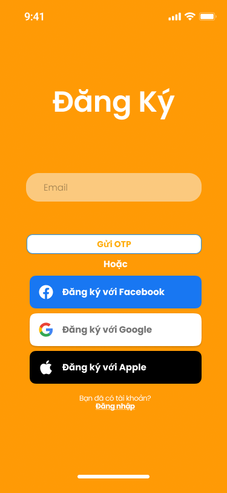
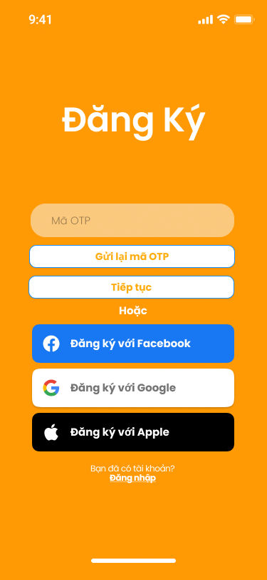
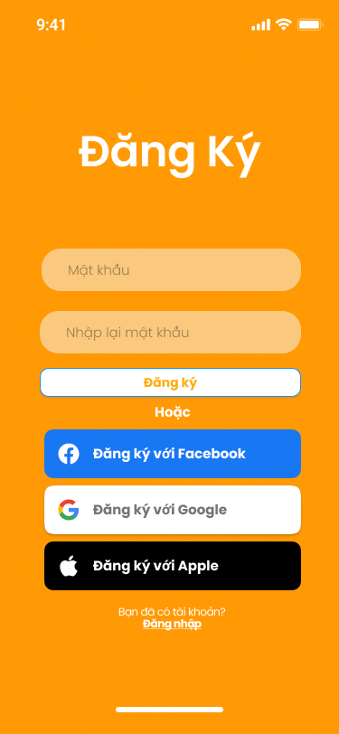

# SmartTrọ — Sign Up UI Implementation Specification

## 1. Trạng thái tài liệu

| Thuộc tính | Giá trị |
| --- | --- |
| Trạng thái nghiệp vụ | **Approved** |
| Trạng thái bàn giao PM | **Ready — đã xác minh Figma và xuất capture email ngày 2026-09-16** |
| Phạm vi | Luồng đăng ký SmartTrọ bằng email, OTP email và mật khẩu |
| Nền tảng | React Native + Expo cho iOS, Android và Expo Web preview |
| Dữ liệu ở giai đoạn UI | Mock trong bộ nhớ; chưa gọi API và chưa gửi email thật |
| Ngày lập | 2026-09-15 |
| Ngày cập nhật quyết định email | 2026-09-16 |
| Phê duyệt | PO đã duyệt `SIGNUP-D01` đến `SIGNUP-D20` |

Tài liệu này là nguồn triển khai trực tiếp cho Sign Up SmartTrọ. Quyết định mới nhất thay thế yêu cầu đăng ký bằng số điện thoại trong các tài liệu cũ: **email là định danh đăng nhập duy nhất của tài khoản MVP; số điện thoại chỉ là dữ liệu liên hệ tùy chọn và không dùng để xác định tài khoản duy nhất**.

Tài liệu và capture hiện đã khớp với luồng email. PM, Dev và QA phải dùng trực tiếp tài liệu UC này cho Sign Up SmartTrọ. Các policy backend còn mở được ghi ngay trong UC này; không dùng một tài liệu quyết định Auth Identity trung gian.

## 2. Mục tiêu và kết quả mong đợi

Luồng đăng ký gồm ba bước:

1. Nhập email và yêu cầu mã OTP.
2. Nhập mã OTP 6 chữ số nhận qua email.
3. Tạo mật khẩu, xác nhận mật khẩu và hoàn tất đăng ký.

Sau khi đăng ký thành công, ứng dụng chuyển về Sign In và không tự đăng nhập.

Kết quả cần đạt:

- Email được chuẩn hóa và dùng làm định danh unique của tài khoản MVP.
- Người dùng phải xác minh quyền sở hữu email trước khi đặt mật khẩu.
- Luồng UI giữ nguyên trạng thái không nhạy cảm khi người dùng chuyển sang ứng dụng email rồi quay lại.
- OTP, mật khẩu và xác nhận mật khẩu không được ghi vào persistent storage, route parameters hoặc log.
- UI bám Figma sau khi phần chữ được cập nhật sang email; Dev không chép React/Tailwind do Figma sinh ra.
- Giai đoạn review UI có mock gateway rõ ràng và không tạo business rule ngầm.

## 3. Nguồn và thứ tự ưu tiên

### 3.1. Nguồn thiết kế

Figma file `Smart Platform`, file key `rsjbGO3ul8lzKKKTj38r0t`, page `SmartTrọ`.

| Bước | Figma node hiện có | Trạng thái sử dụng |
| --- | --- | --- |
| Nhập email | `237:1161` — `Sign Up (Input Email) - iPhone` | **Ready** — label `Email`, action `Gửi OTP` |
| Nhập OTP | `237:1137` — `Sign Up (Input OTP) - iPhone` | **Ready** — OTP và resend đã hiển thị |
| Tạo mật khẩu | `237:1185` — `Sign Up (Input Password) - iPhone` | **Ready** — mật khẩu, xác nhận mật khẩu và action đăng ký |

Capture baseline đã xuất từ đúng page `SmartTrọ` ngày 2026-09-16 và đặt tại `docs/assets/smarttro-auth/`:

- `sign-up-email.png`.
- `sign-up-otp.png`.
- `sign-up-password.png`.

Các file cũ trong `docs/assets/smarttro-sign-up/` chỉ là lịch sử và không còn là baseline nội dung.

#### Capture 1 — Nhập email



#### Capture 2 — Nhập OTP email



#### Capture 3 — Tạo mật khẩu



### 3.2. Nguồn requirement

- Quyết định PO ngày 2026-09-16 trong tài liệu này.
- `docs/use-cases/smarttro/UC-02-sign-in.md` cho hành vi điều hướng và đăng nhập sau khi đăng ký.
- `Requirement_List/Requirements List - SmartTrọ.xlsx`, `SM001`.
- `User_Stories/User Story - SmartTrọ.xlsx`, sheet `Đăng kýĐăng nhập`, User Story `1.0`.
- `SRS/SRS (SmartTrọ).docx`, UC Sign Up sau khi cập nhật.

Hai Activity Diagram email đã được cập nhật cùng source `.puml` trong `Activity_Diagrams/`. Các bản `By Phone` chỉ là lịch sử và không còn là baseline MVP.

### 3.3. Quy tắc khi có mâu thuẫn

1. Quyết định PO mới nhất trong task/comment.
2. Tài liệu UC hiện tại; với hành vi chuyển sang Sign In, dùng thêm `docs/use-cases/smarttro/UC-02-sign-in.md`.
3. Markdown handoff mới nhất trong `docs/`.
4. Requirement List, User Story và SRS đã cập nhật.
5. Figma cho phần trình bày trực quan.
6. Code foundation cho convention kỹ thuật.

Riêng với **bố cục, màu, typography, kích thước tương đối, thứ tự thành phần và cảm nhận thị giác**, capture Figma tại mục 3.1 là baseline bắt buộc. Foundation chỉ được ưu tiên khi Figma không mô tả state hoặc khi cần áp dụng khác biệt accessibility đã duyệt; Dev không được thay bằng một giao diện foundation khác phong cách chỉ vì component đó đã tồn tại.

Nếu vẫn có conflict, deferred decision hoặc ambiguity mà PM không giải quyết được, PM phải comment vào task và tag PO để chốt trước khi giao Dev.

## 4. Quyết định và câu hỏi của UC

### 4.1. Quyết định đã phê duyệt

| ID | Quyết định | Trạng thái |
| --- | --- | --- |
| SIGNUP-D01 | Dùng font Poppins tương thích Expo, có system fallback | Approved |
| SIGNUP-D02 | Dùng palette accessible đã duyệt: `#A84300` cho text/action trên nền sáng; `#B84D00` chỉ là filled-primary fallback khi một state thực sự cần button nền đặc. Happy-path Auth giữ white CTA + outline + orange text theo Figma | Approved, refined 2026-09-16 |
| SIGNUP-D03 | Social sign-up chỉ visual-only ở review build; production mặc định ẩn đến khi có task riêng | Approved |
| SIGNUP-D04 | Resend OTP ở UI mock có cooldown 60 giây; backend là nguồn policy thật | Approved |
| SIGNUP-D05 | Đăng ký thành công quay về Sign In; không auto-login | Approved |
| SIGNUP-D06 | Áp dụng toàn bộ sai khác accessibility `UI-D01` đến `UI-D07` | Approved |
| SIGNUP-D07 | Định danh Sign Up MVP đổi từ số điện thoại sang email; email normalized là unique login identifier | Approved |
| SIGNUP-D08 | OTP gồm 6 chữ số và gửi qua email; không dùng verification link trong MVP | Approved |
| SIGNUP-D09 | OTP hết hạn sau 10 phút | Approved 2026-09-16 |
| SIGNUP-D10 | Mỗi OTP cho phép tối đa 5 lần nhập sai; sau đó challenge bị vô hiệu hóa và người dùng phải yêu cầu OTP mới | Approved 2026-09-16 |
| SIGNUP-D11 | Resend cách nhau tối thiểu 60 giây, tối đa 5 lần/giờ/email; backend phải có thêm giới hạn IP/device chống abuse | Approved 2026-09-16 |
| SIGNUP-D12 | Endpoint công khai dùng response generic, không xác nhận riêng email đã tồn tại; UI cung cấp lối sang Sign In | Approved 2026-09-16 |
| SIGNUP-D13 | Email provider được bọc sau adapter; chưa khóa vendor trong requirement nghiệp vụ | Approved 2026-09-16 |
| SIGNUP-D14 | Capture Figma là nguồn chuẩn cho visual hierarchy, màu nền, typography, độ bo, thứ tự và phong cách của Auth UI; foundation chỉ bổ sung state còn thiếu và convention kỹ thuật | Approved 2026-09-16 |
| SIGNUP-D15 | `375 × 812` là viewport baseline để review/screenshot, không phải kích thước hard-code; layout phải dùng được từ rộng `320–430 px` và cao từ `568 px` trở lên | Approved 2026-09-16 |
| SIGNUP-D16 | Expo Web chỉ render mobile canvas rộng tối đa `430 px`, căn giữa khi viewport lớn; không tạo desktop composition riêng trong task này | Approved 2026-09-16 |
| SIGNUP-D17 | Social buttons phải hiện trong review build để đối chiếu Figma nhưng chỉ visual-only; production ẩn bằng feature flag đến khi có UC/task riêng | Approved 2026-09-16 |
| SIGNUP-D18 | Poppins và brand icon phải dùng asset/package được quản lý trong repo; không dùng emoji, ký tự thay thế hoặc icon gần giống | Approved 2026-09-16 |
| SIGNUP-D19 | Các state vận hành không có trên frame tĩnh vẫn phải bổ sung, nhưng giữ cùng ngôn ngữ thị giác của Figma và không làm thay đổi happy-path composition | Approved 2026-09-16 |
| SIGNUP-D20 | Chỉ chuẩn bị Android APK sau khi PO phê duyệt web preview; backend production vẫn giữ gate riêng tại mục 14.2 | Approved 2026-09-16 |

### 4.2. Thứ tự triển khai đã phê duyệt

1. Triển khai FE bằng mock gateway.
2. Deploy preview để PO kiểm tra UI, responsive behavior và flow.
3. Chỉ sau khi PO phê duyệt preview mới bắt đầu task backend production.
4. Khi triển khai backend, các giá trị `SIGNUP-D09` đến `SIGNUP-D13` phải được đưa vào API contract/config và test; FE không được dùng mock để thay thế policy production.

## 5. Luồng nghiệp vụ chuẩn

### 5.1. Bước Email

1. Người dùng mở Sign Up.
2. Nhập email.
3. Ứng dụng trim khoảng trắng và lowercase phần dùng để so khớp/unique.
4. FE kiểm tra định dạng cơ bản.
5. Người dùng chọn `Gửi mã OTP`.
6. Mock/API tạo một signup attempt và gửi OTP tới email.
7. Ứng dụng chuyển sang bước OTP.

### 5.2. Bước OTP

1. Hiển thị email đã mask để người dùng biết mã được gửi tới đâu.
2. Người dùng nhập đúng 6 chữ số.
3. Người dùng chọn `Tiếp tục`.
4. Nếu OTP hợp lệ, chuyển sang bước tạo mật khẩu.
5. Nếu OTP sai/hết hạn, giữ người dùng ở bước OTP và hiển thị lỗi phù hợp.
6. `Gửi lại mã` chỉ khả dụng sau cooldown; OTP mới làm OTP cũ mất hiệu lực khi backend thật được triển khai.

### 5.3. Bước Mật khẩu

1. Nhập mật khẩu và xác nhận mật khẩu.
2. FE kiểm tra tối thiểu 8 ký tự, ít nhất một chữ hoa, một chữ số và một ký tự đặc biệt theo requirement hiện tại.
3. Hai giá trị phải trùng nhau.
4. Khi hoàn tất thành công, tài khoản được tạo ở trạng thái email đã xác minh.
5. Hiển thị success feedback và chuyển về Sign In, điền sẵn email nếu an toàn nhưng không điền mật khẩu.

## 6. Trạng thái và dữ liệu UI

### 6.1. State machine

```text
email_input
  -> requesting_otp
  -> otp_input
  -> verifying_otp
  -> password_input
  -> creating_account
  -> success
  -> sign_in
```

Các trạng thái lỗi quay lại bước hiện tại; không nhảy cóc bước và không tạo tài khoản trước khi email được xác minh.

### 6.2. Trạng thái được phép khôi phục

Để người dùng chuyển sang ứng dụng email rồi quay lại mà không bị dựng lại từ đầu, có thể persist:

- `signupAttemptId` không chứa secret.
- `normalizedEmail`.
- `currentStep`.
- `otpRequestedAt`.
- `otpExpiresAt` khi backend trả về.
- `resendAvailableAt`.

Không persist:

- OTP.
- Password.
- Confirm password.
- Access/refresh token trước khi tài khoản được tạo thành công.

Countdown phải tính từ timestamp tuyệt đối, không chỉ giảm một biến trong memory. Khi app resume, UI tính lại thời gian còn lại từ `resendAvailableAt`/`otpExpiresAt`.

### 6.3. Back, close và resume

- Back từ Password về OTP: xóa password và confirm password.
- Back từ OTP về Email: xóa OTP; giữ email để sửa.
- Rời flow: xóa toàn bộ dữ liệu nhạy cảm; attempt có thể được resume theo policy backend nếu còn hiệu lực.
- App background/foreground: giữ step và email; không reload/reset UI chỉ vì người dùng mở ứng dụng email.
- Attempt hết hạn khi resume: thông báo rõ và đưa người dùng về bước Email hoặc cho gửi lại mã theo policy.

## 7. UI specification

### 7.1. Cấu trúc chung

- Dùng `SafeAreaView`/safe-area thật; không vẽ status bar hoặc home indicator giả.
- Container chính scroll được khi bàn phím mở và trên màn hình thấp.
- Primary button có chiều cao/vùng chạm tối thiểu 48 px.
- Poppins là font ưu tiên; có system fallback nếu font chưa tải xong.
- Không dùng màu cam cũ có contrast thấp cho text/action. Happy-path CTA giữ white surface + outline + orange action text theo capture; không đổi thành solid rust button.
- Nền màn hình là orange brand surface toàn màn như capture; không bọc form trong white card, không thêm kicker, subtitle hoặc decorative component ngoài baseline nếu chưa được PO duyệt.
- Title, input, CTA, separator `Hoặc`, social buttons và account link phải giữ đúng thứ tự, alignment và visual hierarchy của capture.
- Quy tắc chiều rộng mobile:
  - viewport `320–359 px`: padding ngang `20 px`;
  - viewport `360–399 px`: padding ngang `40 px`;
  - viewport `400–430 px`: padding ngang `48 px`;
  - form/social stack rộng `100%` trong vùng trên và không vượt `334 px`.
- `375 × 812` là baseline screenshot. Bắt buộc kiểm tra thêm `320 × 568`, `390 × 844` và `430 × 932`; không được clip CTA, link hoặc nội dung khi font scaling mặc định và khi bàn phím mở.
- Với Expo Web có viewport lớn hơn `430 px`, canvas mobile rộng tối đa `430 px`, `min-height: 100dvh` và căn giữa. Phần ngoài canvas chỉ dùng neutral backdrop hoặc cùng orange surface; không kéo form thành desktop layout.
- Landscape/tablet ngoài baseline chỉ cần giữ một cột dễ đọc, căn giữa, không overflow; desktop/tablet composition riêng nằm ngoài scope.

### 7.2. Bước Email

- Title hiển thị: `Đăng ký`.
- Không hiển thị external label ở happy path; dùng placeholder `Email` theo capture và accessibility label riêng cho screen reader.
- Placeholder: `Email`.
- Keyboard/content type: email address; tắt auto-capitalize; cho phép paste.
- Primary action hiển thị: `Gửi OTP`.
- Link phụ: `Đã có tài khoản? Đăng nhập`.
- Sau primary action phải có separator `Hoặc`, ba social buttons theo đúng thứ tự Facebook, Google, Apple rồi mới tới account link.
- Inline error tối thiểu: trống, sai định dạng, email đã tồn tại, lỗi gửi mã.
- Không dùng thông báo khác nhau để tiết lộ email đã tồn tại ở endpoint công khai nếu backend chọn generic anti-enumeration response; contract cụ thể phải được chốt ở task backend.

### 7.3. Bước OTP

- Visible title vẫn là `Đăng ký` để khớp capture; semantic/accessibility screen name là `Xác thực email`.
- Helper: `Nhập mã 6 chữ số đã gửi tới <email đã mask>`.
- OTP chỉ nhận chữ số, tối đa 6 ký tự, cho phép paste toàn bộ mã.
- Primary action: `Tiếp tục` disabled khi chưa đủ 6 số hoặc đang verify.
- Secondary action: `Gửi lại mã` cùng countdown.
- Happy-path composition vẫn giữ title `Đăng ký`, OTP input, action `Gửi lại mã OTP`, action `Tiếp tục`, separator/social stack và account link như capture; helper/error/countdown được chèn gần OTP field mà không đổi style tổng thể.
- Lỗi tối thiểu: mã sai, mã hết hạn, vượt giới hạn thử, resend thất bại.

### 7.4. Bước Mật khẩu

- Visible title vẫn là `Đăng ký` để khớp capture; semantic/accessibility screen name là `Tạo mật khẩu`.
- Hai field: `Mật khẩu` và `Xác nhận mật khẩu`.
- Có show/hide password và accessibility label.
- Hiển thị rule mật khẩu trước khi submit; không chỉ báo lỗi sau cùng.
- Primary action: `Đăng ký`.
- Happy-path composition giữ title `Đăng ký`, hai field, primary action, separator/social stack và account link theo capture.
- Không lưu password khi back, close hoặc app bị kill.

## 8. Validation và error contract tối thiểu

| Tình huống | Kết quả UI |
| --- | --- |
| Email trống/sai định dạng | Không gửi request; hiển thị lỗi inline |
| Email đã có tài khoản | Hiển thị thông báo theo contract anti-enumeration được backend chốt; có lối sang Sign In |
| Gửi OTP thất bại | Giữ email và cho retry an toàn |
| OTP chưa đủ 6 số | Disable `Tiếp tục` |
| OTP sai | Xóa/đánh dấu field theo thiết kế; giữ ở bước OTP |
| OTP hết hạn | Cho resend theo policy; không sang Password |
| Password không đạt rule | Hiển thị rule chưa đạt; không submit |
| Confirm password không khớp | Lỗi tại confirm field |
| Tạo tài khoản trùng do race condition | Không tạo user thứ hai; hướng dẫn Sign In/khôi phục tài khoản |
| Mất mạng | Giữ state không nhạy cảm, cho retry, không gửi lặp ngầm |

## 9. Technical mapping cho repository `smart-tro`

Giữ implementation theo foundation hiện có. Nếu tên thư mục khác, Dev phải map theo convention repo, không tạo kiến trúc song song chỉ để khớp spec.

Tách tối thiểu:

- Screen/container cho từng bước hoặc một flow container với step components rõ ràng.
- Validation schema cho email/password.
- `SignUpGateway` interface tách mock khỏi API thật.
- Auth flow state có thể restore phần không nhạy cảm.
- Shared input/button/token từ design foundation.

Mock gateway tối thiểu:

- request OTP thành công.
- invalid/expired OTP.
- duplicate email.
- create account thành công/thất bại.
- resend cooldown 60 giây.

## 10. Accessibility và khác biệt có chủ đích với Figma

| ID | Vấn đề của frame cũ | Quyết định triển khai |
| --- | --- | --- |
| UI-D01 | Button thấp hơn vùng chạm an toàn | Vùng chạm tối thiểu 48 px |
| UI-D02 | Chữ trắng trên cam cũ contrast thấp | Happy-path Auth dùng white CTA + outline + `#A84300` text như capture; `#B84D00` chỉ dùng cho filled-primary fallback đã kiểm tra contrast |
| UI-D03 | Text cam cũ trên nền trắng contrast thấp | Dùng `#A84300` cho text/action |
| UI-D04 | OTP không nói mã gửi tới đâu | Hiển thị email đã mask |
| UI-D05 | Thiếu resend/error/loading state | Bổ sung đầy đủ state vận hành |
| UI-D06 | Frame vẽ OS chrome | Dùng OS/safe-area thật |
| UI-D07 | Social button trông như hoạt động | Review visual-only; production ẩn bằng feature flag |

## 11. Kiểm thử bắt buộc trước PR

Dev phải tự lập test cases và chạy unit/component tests cho phần mình thay đổi. Coverage 100% áp dụng cho logic mới của flow Sign Up thuộc phạm vi task; không dùng con số coverage để thay thế test hành vi.

Tối thiểu phải có:

- Email trim/lowercase/format validation.
- OTP trống, ngắn, đủ 6 số, ký tự không phải số, paste 6 số.
- Password rule và confirm mismatch.
- Email → OTP → Password → Success → Sign In.
- Back/resume/background và attempt hết hạn.
- Duplicate email và retry sau network failure.
- Không có OTP/password trong route params, log hoặc storage.
- Accessibility label, focus order, keyboard behavior và vùng chạm.
- Visual regression/manual screenshot ở `375 × 812` cho đủ ba bước, đối chiếu trực tiếp với ba capture tại mục 3.1.
- Responsive smoke test ở `320 × 568`, `390 × 844`, `430 × 932` và web viewport lớn hơn `430 px`; không clip, không horizontal scroll, không kéo canvas thành desktop form.
- Social buttons hiển thị đúng asset/thứ tự ở review build, không thực hiện OAuth và bị ẩn khi production flag tắt.

## 12. Out of scope của UC hiện tại

- Email provider thật và template email production.
- Backend OTP/email provider production trước khi PO duyệt FE preview.
- Social/OAuth account linking.
- Đổi email, quên mật khẩu và account recovery.
- Xác thực số điện thoại.
- Auto-login sau đăng ký.

## 13. Definition of Done

- Ba bước hoạt động đúng với mock gateway trên mobile và Expo Web preview.
- UI bám capture Figma mới đã đổi sang email, các quyết định `SIGNUP-D14` đến `SIGNUP-D20` và các khác biệt `UI-D01` đến `UI-D07`.
- Có screenshot evidence ở `375 × 812`; sai lệch spacing/alignment/radius trong happy path không vượt quá `4 px`, trừ khác biệt safe-area/OS chrome và accessibility đã ghi rõ.
- Responsive checks `320 × 568`, `390 × 844`, `430 × 932` pass.
- State restore không làm lộ hoặc persist OTP/password.
- Unit/component tests cho logic mới đạt 100% coverage và tất cả test pass.
- Lint/typecheck pass.
- PR mô tả test evidence, preview URL/build và các deviation còn lại.
- PM/PO review UI trên build từ code đã merge; QA chỉ test sau khi PR merge và môi trường review/develop dùng đúng merge SHA.

## 14. Gate trước khi bàn giao PM

### 14.1. FE mock và preview

Chỉ chuyển trạng thái tài liệu thành `Ready for PM` khi đủ:

- [x] Figma node đầu tiên đổi từ Phone sang Email.
- [x] OTP helper đổi từ SMS/số điện thoại sang email đã mask.
- [x] Ba capture mới được xuất cùng một revision Figma và nhúng lại vào tài liệu.
- [x] Requirement List `SM001` dùng email.
- [x] User Story `1.0` dùng email OTP 6 chữ số.
- [x] SRS heading/logic Sign Up dùng email.
- [x] Activity Diagram Sign Up by Email không còn bước/text số điện thoại; có source `.puml`.
- [x] Hành vi sau đăng ký và các ràng buộc liên UC được truy vết tới `docs/use-cases/smarttro/UC-02-sign-in.md`.

- [ ] FE mock được triển khai và unit/component tests pass.
- [ ] Preview được deploy từ đúng merge SHA.
- [ ] Preview bám visual baseline tại `375 × 812` và pass responsive matrix đã chốt.
- [ ] PO review và phê duyệt preview.
- [ ] Chỉ sau PO approval mới chuẩn bị Android APK preview; không tự đưa APK/Google Drive vào task visual hiện tại.

### 14.2. Backend production

- [x] `SIGNUP-D09` đến `SIGNUP-D13` đã được PO chốt.
- [ ] FE preview đã được PO phê duyệt.
- [ ] API contract, provider adapter, rate limit và OTP policy được cập nhật theo quyết định đã chốt.
- [ ] QA có test data và environment contract thực tế.

PM được phép giao FE mock/deploy preview ngay. PM không được giao backend production trước khi toàn bộ gate 14.2 hoàn tất.
