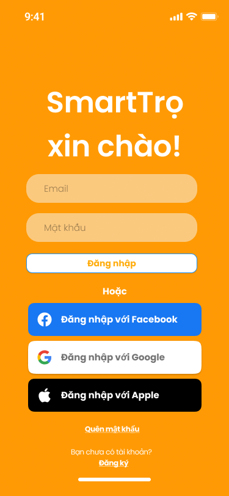

# SmartTrọ — UC-02 Sign In Implementation Specification

## 1. Trạng thái tài liệu

| Thuộc tính | Giá trị |
| --- | --- |
| Use Case | `UC-02` — Đăng nhập bằng email và mật khẩu |
| Trạng thái nghiệp vụ | **Approved cho FE mock và UI review** |
| Trạng thái bàn giao PM | **Ready cho FE mock; backend production còn các policy phải chốt tại mục 4.2** |
| Phạm vi | Sign In SmartTrọ bằng email và mật khẩu; không yêu cầu OTP trong luồng thông thường |
| Nền tảng | React Native + Expo cho iOS, Android và Expo Web preview |
| Dữ liệu ở giai đoạn UI | Mock gateway; chưa phát hành session/token production |
| Ngày chốt email identity | 2026-09-16 |
| Ngày chuẩn hóa theo UC | 2026-09-16 |
| Phê duyệt visual/responsive | PO đã duyệt `SIGNIN-D13` đến `SIGNIN-D19` ngày 2026-09-16 |
| Ngày cập nhật typography sau GLI-48 | 2026-09-17 |

Tài liệu này là nguồn triển khai và kiểm thử trực tiếp cho PM, Dev và QA của `UC-02`. Không tồn tại tài liệu “Auth Identity MVP” trung gian. Quyết định nào tác động đến Sign In phải được ghi, phê duyệt và kiểm thử ngay trong UC này.

Email đã chuẩn hóa là định danh đăng nhập duy nhất trong MVP. Số điện thoại chỉ là dữ liệu liên hệ tùy chọn, không dùng làm credential hoặc khóa unique của tài khoản.

## 2. Mục tiêu và kết quả mong đợi

Người dùng có tài khoản đã kích hoạt có thể đăng nhập bằng email và mật khẩu để tạo session và truy cập ứng dụng.

Kết quả cần đạt:

- Email được trim và chuẩn hóa trước khi gửi sang gateway.
- Mật khẩu được giữ nguyên ký tự, không log, không đưa vào route parameters và không persist dưới dạng plaintext.
- Đăng nhập thông thường không yêu cầu OTP.
- UI ngăn gửi request lặp trong lúc đang xử lý.
- Thông báo credential sai không tiết lộ riêng việc email có tồn tại hay không.
- Email từ `UC-01 Sign Up` có thể được điền sẵn an toàn sau khi đăng ký thành công; OTP và mật khẩu không được truyền sang Sign In.
- UI bám capture Figma hiện tại nhưng có đầy đủ error, loading, keyboard và accessibility state cần cho vận hành.

## 3. Nguồn và thứ tự ưu tiên

### 3.1. Nguồn thiết kế

Figma file `Smart Platform`, file key `rsjbGO3ul8lzKKKTj38r0t`, page `SmartTrọ`.

| Màn hình | Figma node | Trạng thái sử dụng |
| --- | --- | --- |
| Sign In | `237:822` | **Ready** — có field `Email`, `Mật khẩu`, action `Đăng nhập`, `Quên mật khẩu` và điều hướng sang `Đăng ký` |

Capture baseline đã xuất từ đúng page `SmartTrọ` ngày 2026-09-16:



Capture là baseline trình bày. Requirement về validation, lỗi, loading, security và accessibility trong tài liệu này có ưu tiên cao hơn các state không thể hiện trên frame tĩnh.

### 3.2. Nguồn requirement

- Quyết định PO ngày 2026-09-16 được ghi trong UC này.
- `Requirement_List/Requirements List - SmartTrọ.xlsx`, `SM002`.
- `User_Stories/User Story - SmartTrọ.xlsx`, sheet `Đăng kýĐăng nhập`, User Story `2.0`.
- `SRS/SRS (SmartTrọ).docx`, `UC-2`.
- Activity Diagram Sign In by Email và source `.puml` trong `Activity_Diagrams/`.
- `docs/use-cases/smarttro/UC-01-sign-up.md` cho hành vi chuyển về Sign In sau đăng ký.
- `docs/use-cases/smarttro/UC-03-forgot-password.md` cho flow khi chọn `Quên mật khẩu`; UC-03 đã được PO duyệt ngày 2026-09-22 và triển khai theo thứ tự FE-first.

### 3.3. Quy tắc khi có mâu thuẫn

1. Quyết định PO mới nhất trong task/comment.
2. Tài liệu `UC-02` hiện tại.
3. Requirement List, User Story, SRS/FRS và Activity Diagram đã cập nhật.
4. Figma cho phần trình bày trực quan.
5. Code foundation cho convention kỹ thuật.

Riêng với **bố cục, màu, typography, kích thước tương đối, thứ tự thành phần và cảm nhận thị giác**, capture Figma tại mục 3.1 là baseline bắt buộc. Foundation chỉ được ưu tiên khi Figma không mô tả state hoặc khi cần áp dụng khác biệt accessibility đã duyệt; Dev không được thay bằng một giao diện foundation khác phong cách chỉ vì component đó đã tồn tại.

Nếu có conflict, deferred decision hoặc ambiguity mà PM không có đủ thông tin, PM phải comment ngay trên task và tag PO để chốt trước khi giao Dev. Không tạo một tài liệu quyết định tổng hợp để thay thế việc chốt trong UC.

## 4. Quyết định và câu hỏi của UC

### 4.1. Quyết định đã phê duyệt

| ID | Quyết định | Trạng thái |
| --- | --- | --- |
| SIGNIN-D01 | Sign In MVP dùng email và mật khẩu | Approved |
| SIGNIN-D02 | Sign In thông thường không yêu cầu OTP sau khi credential hợp lệ | Approved |
| SIGNIN-D03 | Email normalized là unique login identifier; số điện thoại là contact tùy chọn | Approved |
| SIGNIN-D04 | Credential sai dùng thông báo generic, không xác nhận riêng email có tồn tại | Approved |
| SIGNIN-D05 | Khi request đang xử lý, UI disable action và không gửi request trùng | Approved |
| SIGNIN-D06 | Sau Sign Up, Sign In chỉ được nhận email prefill an toàn; không nhận OTP hoặc mật khẩu | Approved |
| SIGNIN-D07 | Social login chưa thuộc scope MVP; các button trên Figma chỉ visual-only ở review build và ẩn trong production đến khi có UC/task riêng | Approved theo phạm vi MVP hiện tại |
| SIGNIN-D08 | Link `Quên mật khẩu` điều hướng sang `UC-03`; không tự định nghĩa recovery trong UC này | Approved |
| SIGNIN-D09 | Sau 5 lần sai liên tiếp, tạm khóa/throttle đăng nhập 15 phút; không khóa vĩnh viễn | Approved 2026-09-16 |
| SIGNIN-D10 | Access token 15 phút; refresh session 30 ngày; refresh token phải rotation | Approved 2026-09-16 |
| SIGNIN-D11 | Logout mặc định kết thúc thiết bị hiện tại; hỗ trợ logout toàn bộ thiết bị; reset mật khẩu revoke toàn bộ session cũ | Approved 2026-09-16 |
| SIGNIN-D12 | Account chưa xác minh trả `ACCOUNT_UNVERIFIED` và chuyển về bước OTP của UC-01 với email prefill; không tạo account mới | Approved 2026-09-16 |
| SIGNIN-D13 | Capture Figma là nguồn chuẩn cho visual hierarchy, màu nền, typography, độ bo, thứ tự và phong cách của Auth UI; foundation chỉ bổ sung state còn thiếu và convention kỹ thuật | Approved 2026-09-16 |
| SIGNIN-D14 | `375 × 812` là viewport baseline để review/screenshot, không phải kích thước hard-code; layout phải dùng được từ rộng `320–430 px` và cao từ `568 px` trở lên | Approved 2026-09-16 |
| SIGNIN-D15 | Expo Web chỉ render mobile canvas rộng tối đa `430 px`, căn giữa khi viewport lớn; không tạo desktop composition riêng trong task này | Approved 2026-09-16 |
| SIGNIN-D16 | Social buttons phải hiện trong review build để đối chiếu Figma nhưng chỉ visual-only; production ẩn bằng feature flag đến khi có UC/task riêng | Approved 2026-09-16 |
| SIGNIN-D17 | Dùng Be Vietnam Pro cho SmartTrọ Auth: `400Regular` cho input/placeholder/body/helper/notice/error và `600SemiBold` cho title/action/link/separator/social label; font và brand icon phải dùng asset/package được quản lý trong repo, không dùng emoji, ký tự thay thế, icon gần giống hoặc system-font fallback cho application content | Approved 2026-09-16, revised after GLI-48 on 2026-09-17 |
| SIGNIN-D18 | Các state vận hành không có trên frame tĩnh vẫn phải bổ sung, nhưng giữ cùng ngôn ngữ thị giác của Figma và không làm thay đổi happy-path composition | Approved 2026-09-16 |
| SIGNIN-D19 | Chỉ chuẩn bị Android APK sau khi PO phê duyệt web preview; backend production vẫn giữ gate riêng tại mục 14.2 | Approved 2026-09-16 |

### 4.2. Thứ tự triển khai đã phê duyệt

1. Triển khai FE bằng mock gateway.
2. Deploy preview để PO kiểm tra UI, responsive behavior và flow liên kết UC-01/UC-02.
3. Chỉ sau khi PO phê duyệt preview mới bắt đầu task backend production.
4. Backend phải áp dụng `SIGNIN-D09` đến `SIGNIN-D12` qua API/session contract và test; FE không tự mô phỏng chúng thành policy production.

## 5. Luồng nghiệp vụ chuẩn

### 5.1. Happy path

1. Người dùng mở Sign In.
2. Nhập email và mật khẩu.
3. FE trim email và lowercase giá trị dùng để đối chiếu identifier; mật khẩu không được biến đổi.
4. FE kiểm tra định dạng email và dữ liệu bắt buộc.
5. Người dùng chọn `Đăng nhập`.
6. UI chuyển sang loading và chặn submit lặp.
7. Gateway xác thực credential.
8. Nếu thành công, hệ thống tạo session theo contract backend và điều hướng vào app.

### 5.2. Credential không hợp lệ

1. Gateway trả lỗi credential chung.
2. UI giữ email, không persist mật khẩu và hiển thị thông báo không tiết lộ email tồn tại.
3. Người dùng có thể sửa dữ liệu và thử lại theo policy rate limit/lockout đã được backend chốt.

### 5.3. Điều hướng liên UC

- `Đăng ký` → `UC-01 Sign Up`.
- `Quên mật khẩu` → `UC-03 Forgot Password`; UC-03 dùng ba màn riêng Email → OTP → Mật khẩu mới và không thêm OTP inline vào màn Email.
- Account chưa xác minh → resume `UC-01` theo contract được chốt tại `SIGNIN-Q04`.

## 6. Trạng thái và dữ liệu UI

### 6.1. State machine

```text
idle
  -> validating
  -> submitting
  -> authenticated
  -> app

submitting
  -> credential_error
  -> network_error
  -> locked_or_rate_limited
  -> unverified_account
  -> idle
```

Không tạo session hoặc điều hướng vào app khi gateway chưa xác nhận thành công.

### 6.2. Trạng thái được phép giữ

Có thể giữ trong screen/navigation state:

- `normalizedEmail` hoặc email hiển thị do `UC-01` chuyển sang.
- trạng thái `isSubmitting` chỉ trong memory của màn hiện tại.
- lỗi không nhạy cảm phục vụ hiển thị UI.

Không persist hoặc đưa vào route parameters/log:

- mật khẩu;
- access token/refresh token dạng plaintext;
- lỗi backend chứa dữ liệu nội bộ;
- OTP từ UC khác.

### 6.3. Back, close và resume

- App background/foreground không được tự gửi lại request đăng nhập.
- Nếu request đã có kết quả khi app resume, UI xử lý đúng một kết quả và không tạo session trùng.
- Nếu screen bị unmount, xóa mật khẩu khỏi state của flow.
- Email có thể được giữ để giảm thao tác; mật khẩu phải được nhập lại nếu lifecycle an toàn yêu cầu.

## 7. UI specification

### 7.1. Cấu trúc chung

- Safe area thật; không dựng lại OS chrome từ frame Figma.
- Nội dung scroll được khi bàn phím mở hoặc thiết bị có chiều cao thấp.
- Logo/heading `SmartTrọ xin chào!` theo visual baseline.
- Nền màn hình là orange brand surface toàn màn như capture; không bọc form trong white card, không thêm kicker, subtitle hoặc decorative component ngoài baseline nếu chưa được PO duyệt.
- Heading, hai input, CTA, separator `Hoặc`, social buttons, `Quên mật khẩu` và account link phải giữ đúng thứ tự, alignment và visual hierarchy của capture.
- Input, button và text action dùng component foundation nếu component đó có thể skin đúng Figma; nếu không, cập nhật variant/token Auth thay vì dùng nguyên visual mặc định khác phong cách.
- Quy tắc chiều rộng mobile:
  - viewport `320–359 px`: padding ngang `20 px`;
  - viewport `360–399 px`: padding ngang `40 px`;
  - viewport `400–430 px`: padding ngang `48 px`;
  - form/social stack rộng `100%` trong vùng trên và không vượt `334 px`.
- `375 × 812` là baseline screenshot. Bắt buộc kiểm tra thêm `320 × 568`, `390 × 844` và `430 × 932`; không được clip CTA, link hoặc nội dung khi font scaling mặc định và khi bàn phím mở.
- Với Expo Web có viewport lớn hơn `430 px`, canvas mobile rộng tối đa `430 px`, `min-height: 100dvh` và căn giữa. Phần ngoài canvas chỉ dùng neutral backdrop hoặc cùng orange surface; không kéo form thành desktop layout.
- Landscape/tablet ngoài baseline chỉ cần giữ một cột dễ đọc, căn giữa, không overflow; desktop/tablet composition riêng nằm ngoài scope.

### 7.2. Form Sign In

- Field `Email`: keyboard email, tắt auto-capitalization, hỗ trợ autofill phù hợp.
- Field `Mật khẩu`: secure entry, có show/hide và hỗ trợ password manager/content type phù hợp.
- Happy path không hiển thị external label; placeholder lần lượt là `Email` và `Mật khẩu` theo capture, còn screen reader dùng accessibility label riêng.
- Primary action `Đăng nhập`: disabled khi input chưa hợp lệ hoặc request đang chạy.
- Happy-path CTA giữ white surface + blue outline + orange action text theo capture; không đổi thành solid rust button hoặc button visual mặc định của foundation.
- Link `Quên mật khẩu` và `Đăng ký` có vùng chạm tối thiểu 48 px.
- Error inline/summary phải được screen reader đọc và focus hợp lý.

### 7.3. Social buttons trên frame

- Facebook/Google/Apple chưa thuộc UC này.
- Review build phải hiển thị visual-only để so sánh Figma, theo đúng thứ tự Facebook, Google, Apple và dùng brand asset chuẩn; không được giả lập đăng nhập thành công.
- Khi người dùng nhấn ở review build, chỉ hiển thị feedback an toàn `Chức năng chưa khả dụng trong bản preview`; không điều hướng và không tạo mock session.
- Production mặc định ẩn bằng feature flag cho đến khi có requirement, provider configuration, account-linking rule và test riêng.

## 8. Validation và error contract tối thiểu

| Tình huống | Hành vi bắt buộc |
| --- | --- |
| Email trống hoặc sai định dạng | Lỗi inline; không gọi gateway |
| Mật khẩu trống | Lỗi inline; không gọi gateway |
| Credential sai | Lỗi generic; không xác nhận email tồn tại |
| Submit lặp | Chỉ có một request active |
| Mất mạng/timeout | Giữ email, không log/persist mật khẩu, cho retry rõ ràng |
| Account chưa xác minh | Trả `ACCOUNT_UNVERIFIED`; chuyển về OTP của UC-01 với email prefill; không tạo account trùng |
| Account bị khóa/rate limited | Hiển thị hành động/thời điểm tiếp theo theo contract backend |
| Gateway lỗi 5xx | Không tạo session; thông báo tạm thời và cho retry an toàn |

## 9. Technical mapping cho repository `smart-tro`

Giữ implementation theo foundation hiện có. Nếu tên thư mục khác, Dev map theo convention của repo; không tạo kiến trúc song song chỉ để khớp spec.

Tách tối thiểu:

- Screen/container `SignIn`.
- Validation schema cho email và dữ liệu bắt buộc.
- `SignInGateway` interface tách mock khỏi API thật.
- Auth/session store dùng secure storage theo foundation; không persist plaintext password.
- Shared input/button/token từ design foundation.
- Navigation contract có typed parameter cho email prefill, không có password/OTP.

Mock gateway tối thiểu:

- credential hợp lệ;
- credential sai;
- account chưa xác minh;
- account bị khóa/rate limited;
- timeout/network error;
- server error;
- request thành công trả mock session không chứa production secret.

## 10. Accessibility và khác biệt có chủ đích với Figma

| ID | Vấn đề/state không thể hiện đủ trên frame | Quyết định triển khai |
| --- | --- | --- |
| UI-SI01 | Button/link có vùng chạm nhỏ | Vùng chạm tối thiểu 48 px |
| UI-SI02 | Thiếu error/loading/disabled state | Bổ sung đầy đủ theo mục 8 |
| UI-SI03 | Mật khẩu chưa thể hiện show/hide | Có control truy cập được bằng screen reader |
| UI-SI04 | Frame vẽ OS chrome | Dùng OS/safe-area thật |
| UI-SI05 | Social button trông như hoạt động | Review visual-only; production ẩn bằng feature flag |
| UI-SI06 | Contrast màu action cần đáp ứng accessibility | Dùng palette/token accessible đã được foundation phê duyệt |

## 11. Kiểm thử bắt buộc trước PR

Dev phải tự lập test cases và chạy unit/component tests cho phần mình thay đổi. Coverage 100% áp dụng cho logic mới của flow Sign In thuộc phạm vi task; không dùng con số coverage để thay thế kiểm thử hành vi.

Tối thiểu phải có:

- Email trim/lowercase và format validation.
- Mật khẩu bắt buộc nhưng không bị trim/biến đổi.
- Submit hợp lệ chỉ tạo một request.
- Credential sai dùng lỗi generic.
- Timeout/network/server error không tạo session.
- Account chưa xác minh không tạo account/session trùng.
- Email prefill từ `UC-01`; không nhận password/OTP qua navigation.
- App background/foreground không submit lặp.
- Không có password/token trong log, route parameters hoặc storage không an toàn.
- Accessibility label, focus order, keyboard, password manager và vùng chạm.
- Social action không hoạt động ở production khi chưa có feature riêng.
- Visual regression/manual screenshot ở `375 × 812`, đối chiếu trực tiếp capture tại mục 3.1.
- Responsive smoke test ở `320 × 568`, `390 × 844`, `430 × 932` và web viewport lớn hơn `430 px`; không clip, không horizontal scroll, không kéo canvas thành desktop form.
- Social buttons hiển thị đúng asset/thứ tự ở review build, không thực hiện OAuth và bị ẩn khi production flag tắt.

QA chỉ test sau khi PR đã merge và môi trường review/develop chạy đúng merge SHA. QA phải dùng dữ liệu và contract thực của môi trường đó, không tự dựng một happy-case environment tách rời.

## 12. Out of scope của UC hiện tại

- Backend token/session/lockout production trước khi PO duyệt FE preview.
- Social/OAuth login và account linking.
- OTP/MFA cho thiết bị mới hoặc hành động rủi ro cao.
- Quên mật khẩu ngoài việc điều hướng sang `UC-03`.
- Đổi email, đổi mật khẩu và quản lý thiết bị/session.
- Xác thực hoặc đăng nhập bằng số điện thoại.

## 13. Definition of Done

- Sign In hoạt động đúng với mock gateway trên mobile và Expo Web preview.
- UI bám capture Figma, các quyết định `SIGNIN-D13` đến `SIGNIN-D19` và các khác biệt `UI-SI01` đến `UI-SI06`.
- Có screenshot evidence ở `375 × 812`; sai lệch spacing/alignment/radius trong happy path không vượt quá `4 px`, trừ khác biệt safe-area/OS chrome và accessibility đã ghi rõ.
- Responsive checks `320 × 568`, `390 × 844`, `430 × 932` pass.
- Không yêu cầu OTP trong happy path Sign In.
- Unit/component tests cho logic mới đạt 100% coverage và tất cả test pass.
- Lint/typecheck pass.
- PR ghi rõ test evidence, preview URL/build và các deviation còn lại.
- PM/PO review UI trên build từ code đã merge; QA test trên đúng merge SHA và environment contract.

## 14. Gate trước khi bàn giao PM

### 14.1. FE mock/UI review

- [x] Figma Sign In dùng `Email` và `Mật khẩu`.
- [x] Capture được xuất từ page SmartTrọ và nhúng vào UC.
- [x] Requirement List `SM002` dùng email + mật khẩu.
- [x] User Story `2.0` dùng email + mật khẩu và không yêu cầu OTP trong Sign In thông thường.
- [x] SRS `UC-2` và Activity Diagram đã bỏ OTP bắt buộc sau Sign In.
- [x] Hành vi liên kết `UC-01` và `UC-03` được ghi rõ.

- [ ] FE mock được điều chỉnh theo visual baseline và unit/component tests pass.
- [ ] Preview được deploy từ đúng merge SHA.
- [ ] Preview bám visual baseline tại `375 × 812` và pass responsive matrix đã chốt.
- [ ] PO review và phê duyệt preview.
- [ ] Chỉ sau PO approval mới chuẩn bị Android APK preview; không tự đưa APK/Google Drive vào task visual hiện tại.

### 14.2. Backend production

- [x] `SIGNIN-D09` đến `SIGNIN-D12` đã được PO chốt.
- [ ] FE preview đã được PO phê duyệt.
- [ ] API/error/session contract được cập nhật theo các quyết định đã chốt.
- [ ] QA có test data và environment contract thực tế.

PM được phép giao FE mock/deploy preview ngay. PM không được giao backend production trước khi toàn bộ gate 14.2 hoàn tất.
