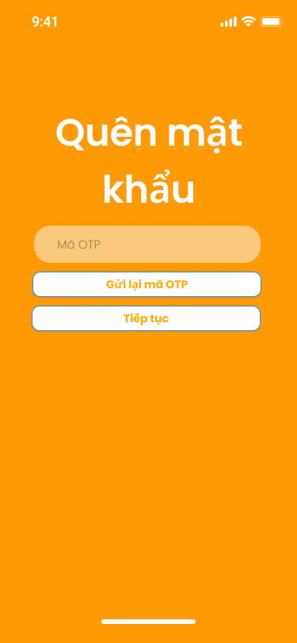
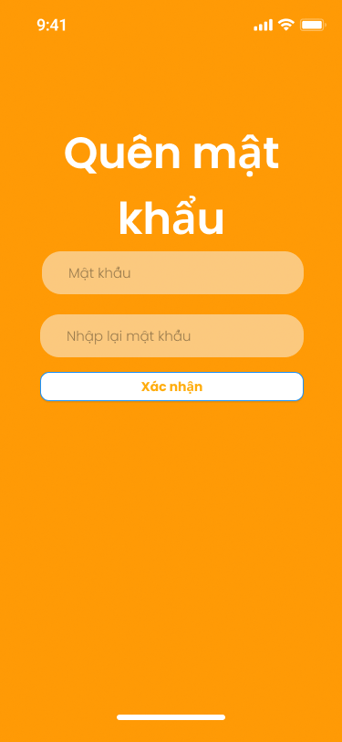

# SmartTrọ — UC-03 Quên mật khẩu bằng Email OTP

## 1. Trạng thái tài liệu

| Thuộc tính | Giá trị |
| --- | --- |
| Trạng thái | **Approved** |
| Ngày chốt | 2026-09-23 |
| Phạm vi | Quên mật khẩu SmartTrọ bằng email, OTP 6 chữ số và mật khẩu mới |
| Figma | Đã xác minh và xuất capture từ page `SmartTrọ` ngày 2026-09-16 |
| Bàn giao | **Ready cho FE-first implementation**; BE chỉ bắt đầu sau khi PO duyệt UI/deploy preview |

Tài liệu này là baseline chung cho PM, Dev và QA. Figma quy định presentation; các business, security, lifecycle và test rule trong tài liệu này quy định behavior.

## 2. Luồng nghiệp vụ đã duyệt

1. Từ Sign In, người dùng chọn `Quên mật khẩu` và được chuyển sang **màn nhập email riêng**.
2. Người dùng nhập email; hệ thống trim, lowercase và validate theo cùng normalization của UC-01/UC-02.
3. Hệ thống luôn phản hồi trung tính: `Nếu email tồn tại, mã xác thực đã được gửi.`
4. Nếu email ánh xạ tới account đủ điều kiện recovery, hệ thống gửi OTP email 6 chữ số và app chuyển sang **màn nhập OTP riêng**.
5. Khi OTP hợp lệ, server cấp reset token ngắn hạn và app chuyển sang **màn đặt mật khẩu mới riêng**.
6. Khi mật khẩu mới hợp lệ, hệ thống đổi mật khẩu, thu hồi toàn bộ session đang hoạt động và đưa người dùng về Sign In với email được điền sẵn; không auto-login.

Không thêm ô OTP động vào màn nhập email. Không gộp màn nhập email và màn OTP nếu chưa có quyết định PO và Figma revision mới.

## 3. Figma traceability và capture

| Bước | Node | Nội dung đã xác minh |
| --- | --- | --- |
| Nhập email | `2005:3286` — `Forget Password (Input Email) - iPhone` | `Email`, `Gửi OTP` |
| Nhập OTP | `2005:3261` — tên layer còn là `Sign Up (Input OTP) - iPhone` | Heading `Quên mật khẩu`, `Mã OTP`, `Tiếp tục`, `Gửi lại mã OTP` |
| Đặt mật khẩu mới | `2005:3310` — tên layer còn là `Sign Up (Input Password) - iPhone` | Heading `Quên mật khẩu`, mật khẩu, nhập lại mật khẩu, `Xác nhận` |

Tên của hai frame sau còn dùng prefix `Sign Up`; Dev và PM phải dùng node ID + nội dung hiển thị để truy vết, không suy luận flow từ tên layer.

### Capture 1 — Nhập email

### Capture 2 — Nhập OTP email

### Capture 3 — Đặt mật khẩu mới

## 4. Quyết định đã duyệt

| ID | Quyết định | Trạng thái |
| --- | --- | --- |
| `FORGOT-D01` | Định danh recovery bằng email đã normalize giống Sign Up/Sign In. | Approved |
| `FORGOT-D02` | Dùng OTP email 6 chữ số; không dùng magic link trong MVP. | Approved |
| `FORGOT-D03` | OTP hết hạn sau 10 phút. | Approved |
| `FORGOT-D04` | Resend có cooldown 60 giây; OTP mới làm vô hiệu OTP cũ. | Approved |
| `FORGOT-D05` | Tối đa 5 lần nhập sai/challenge; vượt ngưỡng phải hủy challenge và yêu cầu gửi mã mới. | Approved |
| `FORGOT-D06` | Rate limit theo email + IP + device: tối đa 5 request/15 phút/email và 20 request/giờ/IP. | Approved |
| `FORGOT-D07` | Giữ ba màn riêng đúng Figma. Sau submit email, luôn hiển thị `Nếu email tồn tại, mã xác thực đã được gửi.`; không tiết lộ email tồn tại và không chèn ô OTP động vào màn email. | Approved |
| `FORGOT-D08` | Sau OTP hợp lệ, server cấp reset token ngắn hạn; không dùng OTP trực tiếp để đổi mật khẩu. | Approved |
| `FORGOT-D09` | Reset token có TTL 10 phút, one-time-use, bind với account + challenge + device/session context phù hợp. | Approved |
| `FORGOT-D10` | Mật khẩu mới dùng đúng policy UC-01; không cho trùng mật khẩu hiện tại nếu backend có thể kiểm tra an toàn. | Approved |
| `FORGOT-D11` | Reset thành công thu hồi toàn bộ access/refresh session đang hoạt động của account. | Approved |
| `FORGOT-D12` | Không auto-login; về Sign In với email prefill và thông báo đổi mật khẩu thành công. | Approved |
| `FORGOT-D13` | Nếu app chỉ background và process còn sống: giữ bước hiện tại trong memory nếu challenge/reset token còn hạn, nhưng luôn xóa hai ô mật khẩu khi resume. Nếu app bị force-close/process bị kill hoặc mở lại sau restart: xóa toàn bộ recovery state, mở entry point Sign In; người dùng phải bắt đầu lại từ bước email và nhận OTP mới. Không persist email, OTP, challenge, mật khẩu hoặc reset token qua app restart. | Approved |
| `FORGOT-D14` | Account chưa verify/social-only không được tự tạo account hoặc tự link provider; vẫn dùng response trung tính và chỉ đi theo linking/support flow khi có requirement riêng. | Approved |
| `FORGOT-D15` | Audit request/resend/verify/reset/revoke theo immutable user ID; mask email; không log OTP/token/password. | Approved |

## 5. Acceptance Criteria

### AC-01 — Gửi yêu cầu recovery

- **Given** người dùng đang ở màn nhập email của UC-03
- **When** người dùng nhập email đúng định dạng và chọn `Gửi OTP`
- **Then** app gửi đúng một request với email đã normalize, chống double-submit và hiển thị response trung tính bất kể email có tồn tại hay không.
- **And** nếu account hợp lệ, OTP 6 chữ số được gửi qua email và app điều hướng sang màn OTP riêng.
- **And** UI không thêm input OTP vào màn email.

### AC-02 — Xác minh OTP

- **Given** challenge còn hạn
- **When** người dùng nhập đúng OTP 6 chữ số
- **Then** server cấp reset token one-time-use TTL 10 phút và app chuyển sang màn đặt mật khẩu mới.
- **When** OTP sai, hết hạn, đã bị thay thế hoặc đã dùng
- **Then** không được chuyển bước; số lần thử và message phải theo policy đã duyệt.

### AC-03 — Resend và anti-abuse

- `Gửi lại mã OTP` chỉ khả dụng sau 60 giây.
- OTP mới vô hiệu OTP cũ ngay khi challenge mới được phát hành.
- Quá 5 lần sai/challenge phải hủy challenge.
- Request vượt rate limit phải bị từ chối bằng response không làm lộ account existence.

### AC-04 — Đặt mật khẩu mới

- Hai trường mật khẩu phải khớp và dùng policy UC-01: tối thiểu 8 ký tự, có ít nhất 1 chữ hoa, 1 số và 1 ký tự đặc biệt.
- Reset token hết hạn, replay hoặc sai binding không được đổi mật khẩu.
- Reset thành công phải revoke toàn bộ session, điều hướng về Sign In, prefill email và không auto-login.

### AC-05 — Background, resume và app restart

- Khi app chỉ chuyển background/foreground và process còn sống, app giữ đúng bước nếu credential recovery còn hạn.
- Khi resume ở bước mật khẩu, các ô mật khẩu luôn rỗng dù reset token vẫn còn hạn.
- Khi challenge/reset token hết hạn trong lúc background, app đưa người dùng về bước email với message rõ ràng.
- Khi app bị force-close/process bị kill hoặc app được mở lại sau restart, app không khôi phục flow recovery; entry point là Sign In và toàn bộ recovery state cũ phải bị xóa.

### AC-06 — Dữ liệu nhạy cảm và lỗi mạng

- Không truyền OTP, password hoặc reset token qua route parameters, analytics hoặc log.
- Không persist email, OTP, challenge, password hoặc reset token của flow recovery qua app restart.
- Lỗi mạng ở màn email có thể giữ email trong memory để sửa/thử lại; lỗi ở màn OTP/password không được lưu OTP/password.

## 6. Trạng thái đồng bộ tài liệu

| Tài liệu | Cập nhật |
| --- | --- |
| `markdown/Requirement_List/Requirements List - SmartTrọ.md` | `SM004` bổ sung baseline nghiệp vụ, security, state lifecycle và thứ tự FE-first |
| `markdown/User_Stories/User Story - SmartTrọ.md` | `US 3.0` đổi từ SĐT sang email OTP và thêm AC testable |
| `markdown/SRS/SRS (SmartTrọ).md` | `UC-3` bổ sung đặc tả, alternate flow và hậu điều kiện |
| `Activity_Diagrams/AD_Forgot Password.puml` | Bổ sung flow email OTP, generic response, expiry/resend/attempt và reset session |
| `docs/use-cases/smarttro/UC-02-sign-in.md` | Cập nhật liên kết UC-03 thành Approved |
| `markdown/FRS/FRS - SmartTrọ.md` | Không sửa trong revision này vì source FRS hiện chỉ đặc tả chi tiết UC-12/14/15; UC-03 dùng file này + SRS làm baseline |

Các file DOCX/XLSX gốc chưa được thay đổi trong revision Markdown này. Khi source office được cập nhật, phải đồng bộ lại Markdown và SHA-256 theo `markdown/README.md`.

## 7. Gate bàn giao và thứ tự triển khai

1. FE dựng đúng ba màn Figma, state/validation và deploy preview/mobile build để PO review.
2. Chỉ sau khi PO duyệt UI, BE mới triển khai challenge, OTP, reset token, password mutation, session revocation và audit.
3. Sau khi BE deploy ổn định, FE map API và xử lý error/loading/lifecycle trên runtime thật.
4. QA test trên build + backend đã deploy, dùng dữ liệu và cấu hình thật của môi trường review; phải test cả UC-01/UC-02 regression.
5. PO thực hiện UAT sau khi QA pass.

PM phải comment và tag PO nếu phát hiện conflict, deferred decision hoặc ambiguity mới. Dev không được tự thay đổi ba màn, identity rule, security policy hoặc app-state behavior đã duyệt.
