# Functional Requirements Specification SmartTrọ

> Bản Markdown được đồng bộ từ [`FRS - SmartTrọ.docx`](../../FRS/FRS%20-%20SmartTro%CC%A3.docx) ngày 2026-09-16.
> SHA-256 nguồn: `782c1e18ef1dfb5934c0d22177ff45f89a0f3cc029642aa1f4255c30d55caaef`.
> File DOCX gốc vẫn là nguồn định dạng chính thức; bản này phục vụ agent tìm kiếm, đọc requirement và truy vết use case.
> Lưu ý: đây là bản chuyển đổi nguyên trạng. Các nội dung auth cũ nếu xuất hiện không được dùng để ghi đè tài liệu của UC tương ứng tại `docs/use-cases/smarttro/`.

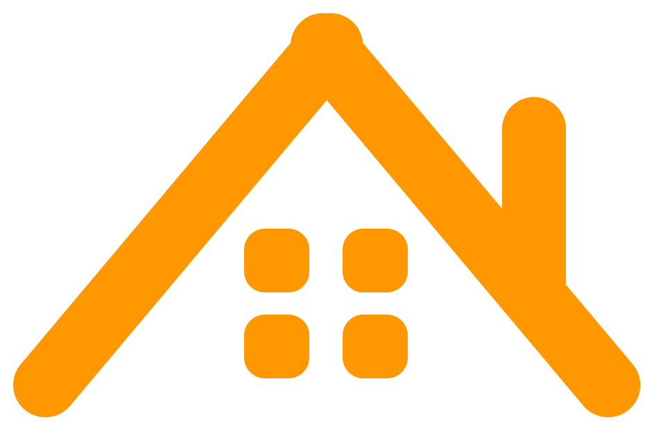

## SmartTrọ

Version: v1.0

Người biên soạn / Creator: Nguyễn Tuấn Nghĩa

Chức danh / Title: Business Analyst

Đơn vị / Department: MindX Technology School

Email: tuannghianguyen1509@gmail.com

Điện thoại/ Phone: 0969066700

Hà Nội, tháng 08 năm 2025

## LỊCH SỬ SỬA ĐỔI VÀ PHÊ DUYỆT

| Ngày | Tác giả | Phiên bản | Tham chiếu lịch sử thay đổi |
| --- | --- | --- | --- |
| 08/08/2025 | Nguyễn Tuấn Nghĩa | 1.0 | Khởi tạo |
| 10/08/2025 | Nguyễn Tuấn Nghĩa | 1.0 | Đặc tả, vẽ activity flow, mô tả màn hình UC-12: Đánh giá và bình luận trong bài đăng về phòng trọ Xây dựng yêu cầu phi chức năng |
| 12/08/2025 | Nguyễn Tuấn Nghĩa | 1.0 | Đặc tả, vẽ activity flow, mô tả màn hình UC-14: Đặt lịch xem trọ Xây dựng yêu cầu phi chức năng |
| 14/08/2025 | Nguyễn Tuấn Nghĩa | 1.0 | Đặc tả, vẽ activity flow, mô tả màn hình UC-15: Nhắn tin với chủ trọ Xây dựng yêu cầu phi chức năng |

Mục lục

LỊCH SỬ SỬA ĐỔI VÀ PHÊ DUYỆT 2

- Thông tin chung 5

- Giới thiệu 5

- Mục đích 5

- Viết tắt 5

- Tham khảo 6

- Tổng quan 7

- Bối cảnh và nguồn gốc dữ liệu 7

- Tóm tắt chức năng chính 7

- Đối tượng người dùng 8

- Môi trường hoạt động của phần mềm 9

- Sơ đồ Use case tổng thể 10

- Phân tích các use case và luồng nghiệp vụ 11

- Danh sách các trường hợp sử dụng của hệ thống 11

- UC-4: Đặt tour 11

- Đặc tả use case 11

- Activity Diagram 13

- Mô tả màn hình 15

- UC-12: Quản lý khách hàng 24

- Đặc tả use case 24

- Activity Diagram 25

- Mô tả màn hình 26

- UC-13: Thiết lập tour 39

- Đặc tả use-case 39

- Activity Diagram 40

- Mô tả màn hình 41

- Các yêu cầu phi chức năng khác 57

- Bảo mật và quyền riêng tư 57

- Hiệu suất và khả năng mở rộng 57

- Tính khả dụng và tương thích 57

- Dễ sử dụng và kiểm soát 57

- Lưu trữ và sao lưu 57

- Phụ lục 58

- Danh sách mẫu Email 58

- Danh sách mẫu SMS 58

- Thông tin chung

- Giới thiệu

Hiện nay, số lượng người có nhu cầu thuê nhà trọ tăng lên hàng năm, tiêu biểu là các trường đại học và các khu công nghiệp, việc mở rộng ký túc xá không đủ nên phần lớn người thuê phải ở tại các nhà trọ trong khu vực. Tuy nhiên, việc tìm phòng trọ hiện nay rất khó khăn do tình hình quỹ đất hạn hẹp, giá nhà cao và uy tín của chủ nhà trọ không được đảm bảo. Người thuê cần một cộng đồng để cùng nhau đánh giá để tìm được nhà trọ uy tín và chất lượng trong tầm giá của mình, và chủ nhà trọ cũng cần một nơi để quảng bá nhà trọ của mình đến nhiều người thuê hơn.

Do đó việc xây dựng 1 nền tảng giúp cả người thuê và chủ trọ cảm thấy dễ dàng hơn trong việc thuê trọ là cần thiết để giúp chủ trọ quản lý nhà trọ tốt hơn, nâng cao chất lượng phục vụ, tối ưu hóa chiến dịch Marketing và tăng doanh thu. Đồng thời, giúp người thuê có 1 cộng đồng đủ uy tín, minh bạch để tin tưởng trong việc tìm, thuê trọ.

- Mục đích

Tài liệu này xác định rõ các yêu cầu chức năng và phi chức năng cho ứng dụng SmartTrọ thuộc nền tảng Smart Platform.

Tài liệu sẽ đóng vai trò hướng dẫn chi tiết cho đội ngũ phát triển và các bên liên quan, đảm bảo hệ thống được xây dựng đáp ứng nhu cầu kinh doanh, tối ưu hóa quy trình làm việc và nâng cao trải nghiệm người dùng. Đồng thời, tài liệu cũng là cơ sở để đánh giá và kiểm thử hệ thống trong các giai đoạn triển khai.

- Viết tắt

| Từ viết tắt | Ý nghĩa |
| --- | --- |
| SRS | System Requirement Specification |
| OTP | One-Time Password |
| API | Application Programming Interface |
| UC | Use case |

- Tham khảo

| STT | Tham khảo | Chi tiết |
| --- | --- | --- |
| 1 | LalaResident | LalaHome Website |
| 2 | Batdongsan | Batdongsan Website |

- Tổng quan

- Bối cảnh và nguồn gốc dữ liệu

Ứng dụng SmartTrọ sử dụng một loạt nguồn dữ liệu để hiển thị thông tin về khách hàng, hợp đồng, hồ sơ, bao gồm:

- Mô hình Functional Decomposition Diagram

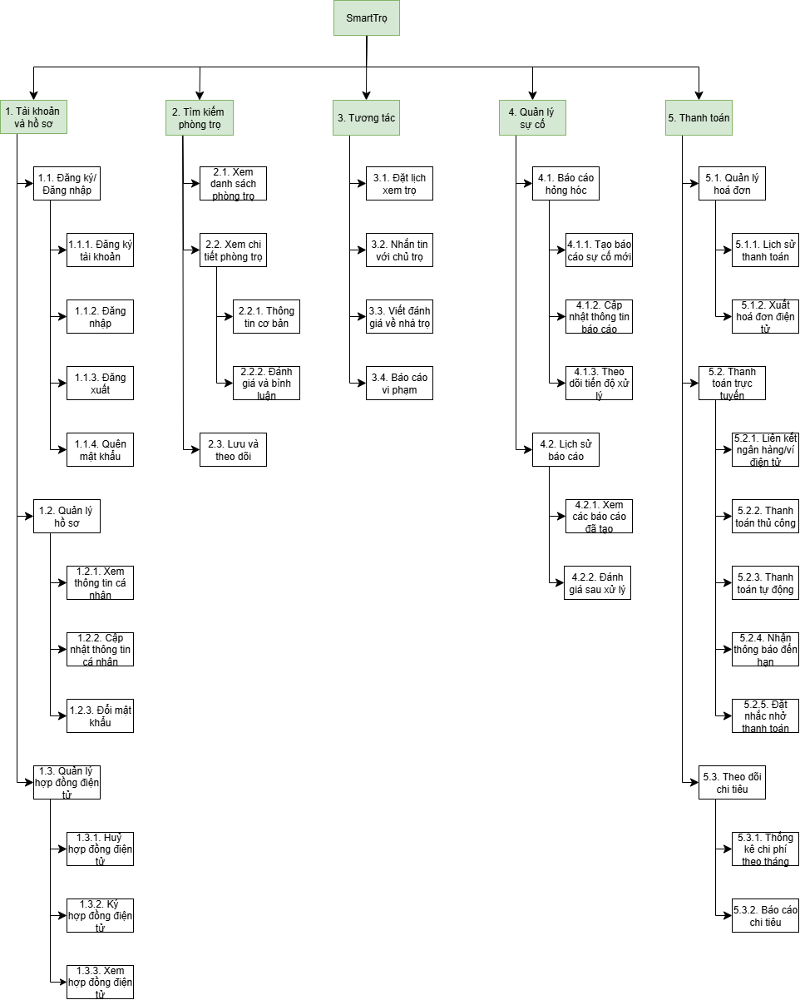

## Hình 1: Sơ đồ phân rã chức năng của phần mềm

- Tóm tắt chức năng chính

- Đối tượng người dùng

Ứng dụng SmartTrọ sẽ chỉ có một loại đối tượng người dùng: Người thuê trọ

- Môi trường hoạt động của phần mềm

Ứng dụng SmartTrọ hoạt động mượt mà trên điện thoại thông minh, yêu cầu như sau:

### Hệ điều hành được hỗ trợ

- iOS phiên bản tối thiểu từ phiên bản 14.0

- Android phiên bản tối thiểu từ phiên bản 8.0

- Sơ đồ Use case tổng thể

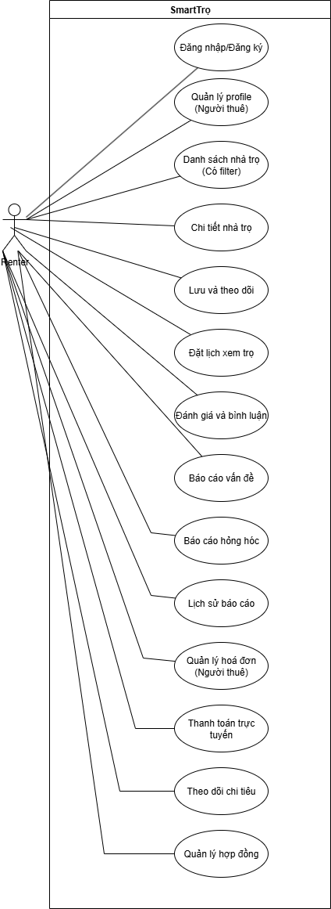

Hình 2: Use Case Diagram tổng thể

2.7 Sơ đồ Use case chi tiết

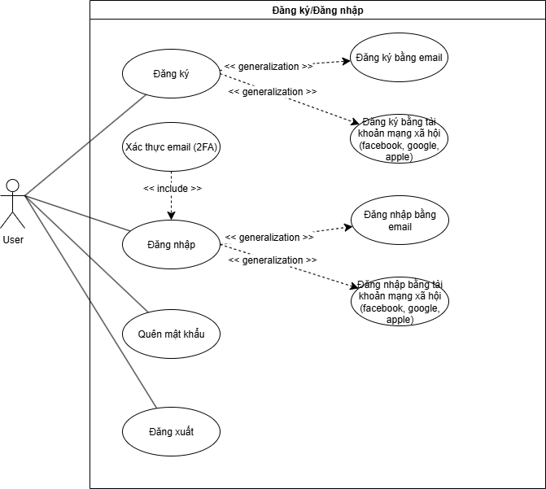

Hình 3: Use Case Diagram đăng nhập/đăng ký

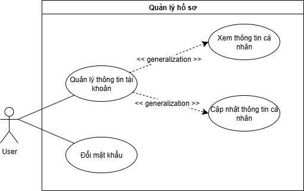

Hình 4: Use Case Diagram quản lý hồ sơ

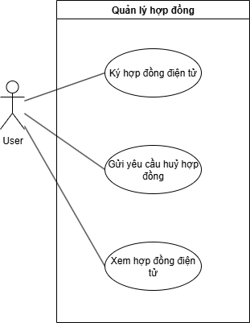

Hình 5: Use Case Diagram quản lý hợp đồng điện tử

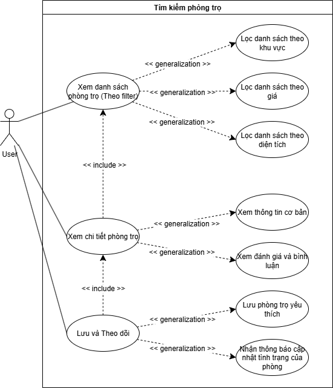

Hình 6: Use Case Diagram tìm kiếm phòng trọ

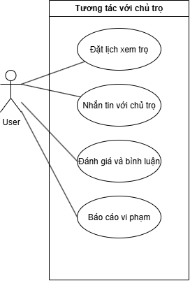

Hình 7: Use Case Diagram tương tác với chủ trọ

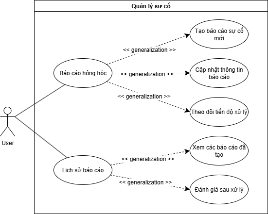

Hình 8: Use Case Diagram quản lý sự cố

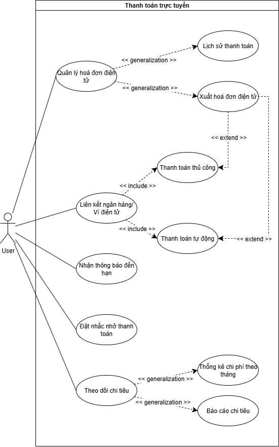

Hình 9: Use Case Diagram thanh toán trực tuyến

2.8. Yêu cầu phi chức năng toàn hệ thống

| STT | Mã NFR | Nội dung |
| --- | --- | --- |
| Yêu cầu về hiệu suất |  |  |
|  | NFR-01 | Thời gian phản hồi |
| 1 | NFR-01.1 | Thời gian tải trang không quá 2 giây |
| 2 | NFR-01.2 | Thời gian tìm kiếm không quá 3 giây |
| 3 | NFR-01.3 | Thời gian xử lý thanh toán không quá 5 giây |
|  | NFR-02 | Khả năng mở rộng |
| 4 | NFR-02.1 | Hệ thống phải hỗ trợ tối thiểu 10,000 người dùng đồng thời |
| 5 | NFR-02.2 | Cơ sở dữ liệu phải lưu trữ thông tin của ít nhất 100,000 phòng trọ |
| 6 | NFR-02.3 | Hệ thống phải xử lý được tối thiểu 1,000 giao dịch thanh toán mỗi giờ |
| Yêu cầu về bảo mật |  |  |
|  | NFR-03 | Bảo mật dữ liệu |
| 7 | NFR-03.1 | Tuân thủ quy định về bảo vệ dữ liệu cá nhân |
| 8 | NFR-03.2 | Kiểm tra bảo mật định kỳ |
| 9 | NFR-03.3 | Mã hóa dữ liệu người dùng và thông tin thanh toán (Bcrypt, Hash) |
|  | NFR-04 | Xác thực và phân quyền (Authorization & Authentication) |
| 10 | NFR-04.1 | Phân quyền truy cập dựa trên vai trò người dùng |
| 11 | NFR-04.2 | Giới hạn số lần đăng nhập thất bại |
| 12 | NFR-04.3 | Hỗ trợ xác thực hai yếu tố (2FA - 2 factors authentication) |
| Yêu cầu về độ tin cậy |  |  |
|  | NFR-05 | Tính sẵn sàng |
| 13 | NFR-05.1 | Hệ thống phải hoạt động 24/7 với thời gian ngừng hoạt động không quá 0.1% |
| 14 | NFR-05.2 | Thời gian phục hồi sau sự cố không quá 2 giờ |
| 15 | NFR-05.3 | Sao lưu dữ liệu hàng ngày |
|  | NFR-06 | Khả năng chịu lỗi |
| 16 | NFR-06.1 | Hệ thống phải tiếp tục hoạt động khi có lỗi một phần |
| 17 | NFR-06.2 | Tự động phát hiện và báo lỗi |
| 18 | NFR-06.3 | Tự động khôi phục sau lỗi không nghiêm trọng |
| Yêu cầu về tính sử dụng |  |  |
|  | NFR-07 | Giao diện người dùng |
| 19 | NFR-07.1 | Thiết kế giao diện thân thiện với người dùng |
| Yêu cầu về tương thích |  |  |
|  | NFR-08 | Tương thích nền tảng |
| 20 | NFR-08.1 | Hỗ trợ iOS 14.0 trở lên và Android 8.0 trở lên |

- Phân tích các use case và luồng nghiệp vụ

- Danh sách các trường hợp sử dụng của hệ thống

| STT | Mã UC | Tên tính năng |
| --- | --- | --- |
| 1 | UC-12 | Đánh giá và bình luận trong bài đăng về phòng trọ |
| 2 | UC-14 | Đặt lịch xem trọ |
| 3 | UC-15 | Nhắn tin với chủ trọ |

- UC-12: Đánh giá và bình luận trong bài đăng về phòng trọ

- Đặc tả use case

- Activity Diagram

- Mô tả màn hình

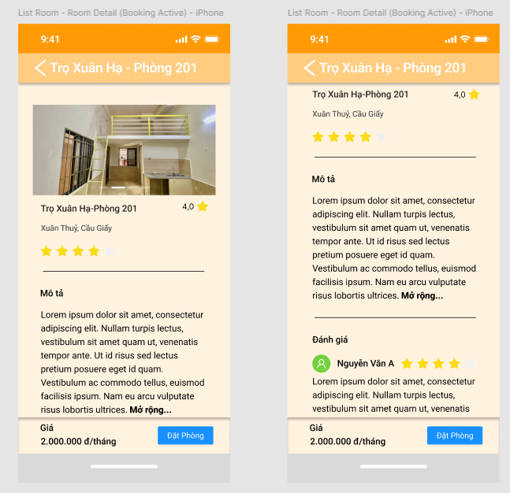

Hình 10: Hiển thị trang chi tiết phòng trọ, phần đánh giá và bình luận về phòng trọ

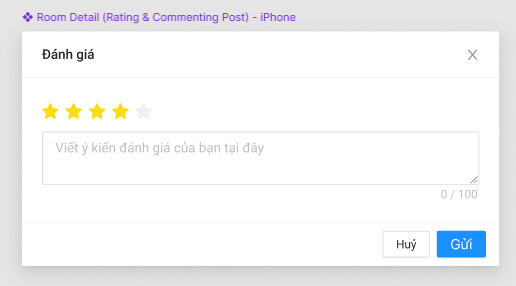

Hình 11: Modal đánh giá hiển thị trên màn hình sau khi bấm chọn số sao đánh giá

- UC-14: Đặt lịch xem trọ

- Đặc tả use case

- Activity Diagram

- Mô tả màn hình

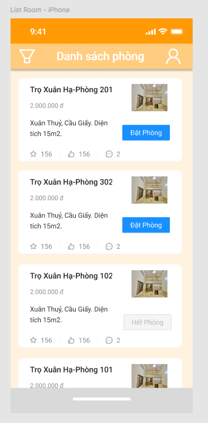

Hình 13. Màn hình tin nhắn

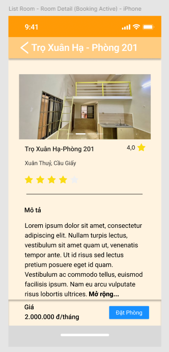

Hình 14. Modal soạn tin nhắn mới

- UC-15: Nhắn tin với chủ trọ

- Đặc tả use-case

- Activity Diagram

- Mô tả màn hình

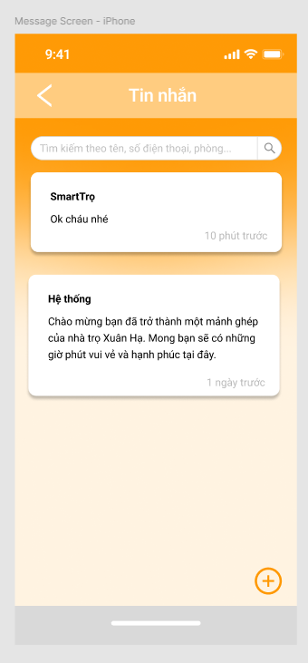

Hình 15. Màn hình tin nhắn

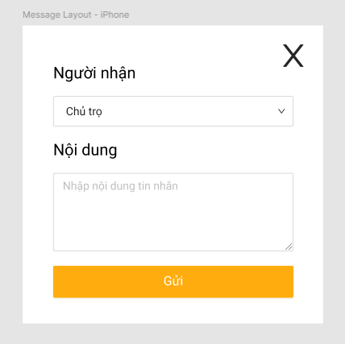

Hình 16. Modal soạn tin nhắn mới
