# Software Requirements Specification SmartTrọ

> Bản Markdown được đồng bộ từ [`SRS (SmartTrọ).docx`](../../SRS/SRS%20%28SmartTro%CC%A3%29.docx) ngày 2026-09-16.
> SHA-256 nguồn: `8cfae5992ace32ba2a206e879ce3ced370a526cf5d96cbb708f6157b94173d34`.
> File DOCX gốc vẫn là nguồn định dạng chính thức; bản này phục vụ tìm kiếm, đọc và lập kế hoạch cho agent.

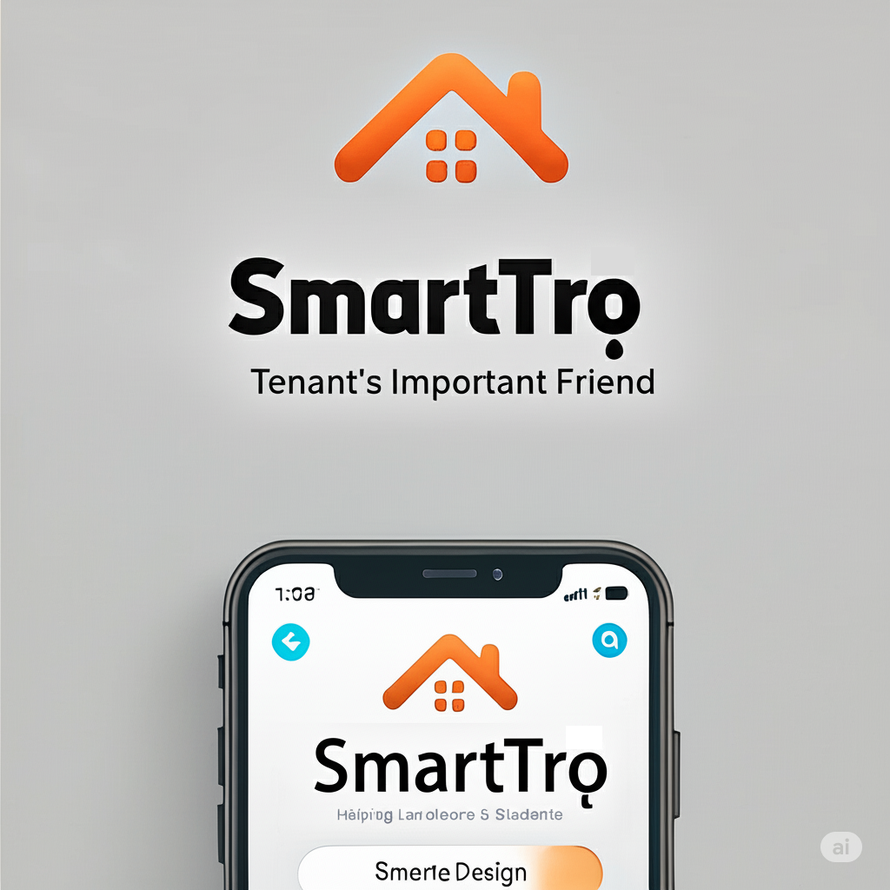

TÀI LIỆU YÊU CẦU PHẦN MỀM

SOFTWARE REQUIREMENTS SPECIFICATION

<Ứng dụng SMARTTRỌ>

Người biên soạn / Creator: Nguyễn Tuấn Nghĩa

Chức danh / Title: Business Analyst

Đơn vị / Department: MindX Technology School

Email:

Điện thoại/ Phone:

Mục Lục

# I. Giới Thiệu / Introduction

## 1. Lịch sử chỉnh sửa tài liệu / History Changes

Danh sách dưới đây thể hiện lịch sử chỉnh sửa tài liệu:

| Phiên bản | Ngày cập nhật | Nội dung cập nhật | Người cập nhật |
| --- | --- | --- | --- |
| 1.0 | 12/05/2025 | Khởi tạo | NghiaNT |
| 1.1 | 16/09/2026 | Cập nhật Sign Up bằng email + OTP email 6 chữ số và Sign In bằng email + mật khẩu; số điện thoại chỉ là dữ liệu liên hệ tùy chọn trong MVP. | NghiaNT / Codex |

## 2. Mục đích / Purpose

Tài liệu này mô tả chi tiết các yêu cầu phần mềm cho dự án SmartTrọ, tập trung vào các chức năng chính:

- Đặt lịch xem trọ.

- Đánh giá và bình luận.

- Quản lý hoá đơn điện tử.

Mục tiêu của tài liệu là cung cấp thông tin chi tiết để phát triển, kiểm thử, và triển khai hệ thống một cách hiệu quả.

## 3. Quy ước tài liệu / Document Conventions

- Tài liệu này sử dụng quy ước về độ ưu tiên của các chức năng như sau:

| STT | Tên mức độ | Mô tả |
| --- | --- | --- |
| 1 | Phải có | Chức năng bắt buộc & ảnh hưởng tới trực tiếp của luồng quy trình nghiệp vụ |
| 2 | Nên có | Chức năng bắt buộc nhưng không ảnh hưởng trực tiếp đến luồng quy trình nghiệp vụ, có thể dời sang Phase sau |
| 3 | Có thể có | Chức năng không bắt buộc nhằm tăng trải nghiệm người dùng |
| 4 | Sẽ không có | Chức năng không nằm trong Scope hiện tại nhưng có thể xem xét cho việc release trong tương lai |

## 4. Đối tượng đọc & Gợi ý cách đọc / Intended Audience and Reading Suggestions

- SRS này dành cho:

- Lập trình viên (Developer): Để hiểu rõ yêu cầu kỹ thuật và chức năng của phần mềm.

- Quản lý dự án (Project Manager): Để lập kế hoạch và phân bổ nguồn lực.

- Người thụ hưởng sản phẩm (End User): Để nắm bắt được cách thức hoạt động và lợi ích của phần mềm.

- Kiểm thử phần mềm (QA / QC): Để xác định các tiêu chí và quy trình kiểm thử.

- Gợi ý cách đọc:

- Đọc từ mục giới thiệu, sau đó tiếp tục với Mô tả tổng quan & Tính năng hệ thống để có cái nhìn toàn diện về sản phẩm.

## 5. Phạm vi dự án / Project Scope

| TRONG DỰ ÁN | NGOÀI DỰ ÁN |
| --- | --- |
| - Đăng ký/Đăng nhập - Quản lý hồ sơ - Tìm kiếm nhà trọ - Tương tác cơ bản (Đặt lịch xem trọ; Đánh giá, bình luận; Báo cáo vấn đề) - Quản lý sự cố - Thanh toán trực tuyến | - Gói tính năng trả tiền |

## 6. Yêu cầu phi chức năng toàn hệ thống / System Non-functional Requirements

| STT | Mã NFR | Nội dung |
| --- | --- | --- |
| Yêu cầu về hiệu suất |  |  |
|  | NFR-01 | Thời gian phản hồi |
| 1 | NFR-01.1 | Thời gian tải trang không quá 2 giây |
| 2 | NFR-01.2 | Thời gian tìm kiếm không quá 3 giây |
| 3 | NFR-01.3 | Thời gian xử lý thanh toán không quá 5 giây |
|  | NFR-02 | Khả năng mở rộng |
| 4 | NFR-02.1 | Hệ thống phải hỗ trợ tối thiểu 10,000 người dùng đồng thời |
| 5 | NFR-02.2 | Cơ sở dữ liệu phải lưu trữ thông tin của ít nhất 100,000 phòng trọ |
| 6 | NFR-02.3 | Hệ thống phải xử lý được tối thiểu 1,000 giao dịch thanh toán mỗi giờ |
| Yêu cầu về bảo mật |  |  |
|  | NFR-03 | Bảo mật dữ liệu |
| 7 | NFR-03.1 | Tuân thủ quy định về bảo vệ dữ liệu cá nhân |
| 8 | NFR-03.2 | Kiểm tra bảo mật định kỳ |
| 9 | NFR-03.3 | Mã hóa dữ liệu người dùng và thông tin thanh toán (Bcrypt, Hash) |
|  | NFR-04 | Xác thực và phân quyền (Authorization & Authentication) |
| 10 | NFR-04.1 | Phân quyền truy cập dựa trên vai trò người dùng |
| 11 | NFR-04.2 | Giới hạn số lần đăng nhập thất bại |
| 12 | NFR-04.3 | Hỗ trợ xác thực hai yếu tố (2FA - 2 factors authentication) |
| Yêu cầu về độ tin cậy |  |  |
|  | NFR-05 | Tính sẵn sàng |
| 13 | NFR-05.1 | Hệ thống phải hoạt động 24/7 với thời gian ngừng hoạt động không quá 0.1% |
| 14 | NFR-05.2 | Thời gian phục hồi sau sự cố không quá 2 giờ |
| 15 | NFR-05.3 | Sao lưu dữ liệu hàng ngày |
|  | NFR-06 | Khả năng chịu lỗi |
| 16 | NFR-06.1 | Hệ thống phải tiếp tục hoạt động khi có lỗi một phần |
| 17 | NFR-06.2 | Tự động phát hiện và báo lỗi |
| 18 | NFR-06.3 | Tự động khôi phục sau lỗi không nghiêm trọng |
| Yêu cầu về tính sử dụng |  |  |
|  | NFR-07 | Giao diện người dùng |
| 19 | NFR-07.1 | Thiết kế giao diện thân thiện với người dùng |
| Yêu cầu về tương thích |  |  |
|  | NFR-08 | Tương thích nền tảng |
| 20 | NFR-08.1 | Hỗ trợ iOS 14.0 trở lên và Android 8.0 trở lên |
| 21 | NFR-08.2 | Tương thích với các trình duyệt phổ biến (Chrome, Safari, Firefox, Edge) |

## 7. Bảng chú giải / Glossary

| Từ (viết tắt) | Định nghĩa |
| --- | --- |
| Use Case Diagram | Sơ đồ trường hợp sử dụng |
| Size | Kích cỡ |
| Business Rule | Quy tắc kinh doanh |
| End-user | Người dùng cuối |

# II. Mô tả tổng quát / Overall Description

## 1. Tổng quan về sản phẩm / Product Perspective

SmartTrọ là một nền tảng cho thuê phòng trọ với các tính năng chính:

- : Người dùng có thể tìm kiếm nhà trọ trong hệ thống của SmartTrọ với các tiêu chí cụ thể như địa điểm, giá tiền, diện tích phòng.

- : Hệ thống cho phép liên kết ngân hàng/ví điện tử, thanh toán tự động hoặc thanh toán thủ công.

- Quản lý hoá đơn điện tử: Người dùng có thể xuất hoá đơn điện tử cho mỗi lần thanh toán.

- Hợp đồng điện tử và chữ ký điện tử: Người dùng quản lý thông tin hợp đồng điện tử và chữ ký điện tử của mình.

### 1.1. Mô hình Functional Decomposition Diagram

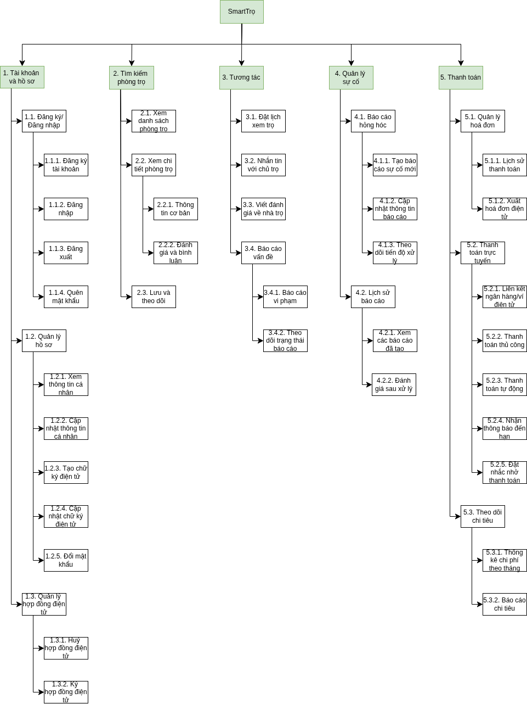

Hình 1: Sơ đồ phân rã chức năng của phần mềm

### 1.2. Mô hình Use Case Diagram

#### 1.2.1. Use Case Diagram tổng quan của phần mềm

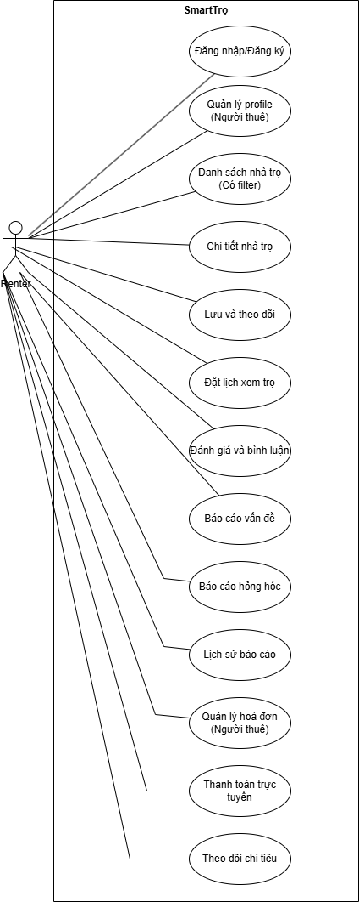

Hình 2: Tổng quan Use Case Diagram của phần mềm

#### 1.2.2. Use Case Diagram chi tiết từng tính năng

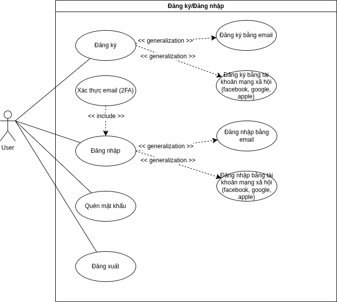

Hình 3: Use Case Diagram đăng nhập/đăng ký

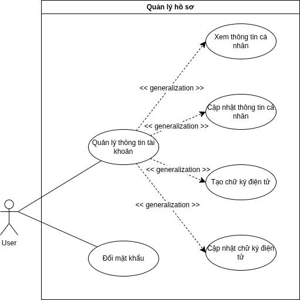

Hình 4: Use Case Diagram quản lý hồ sơ

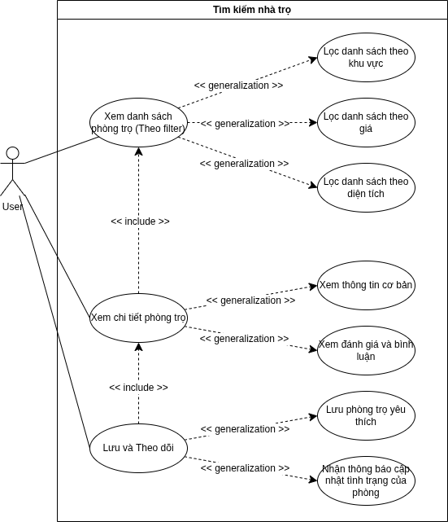

Hình 5: Use Case Diagram tìm kiếm phòng trọ

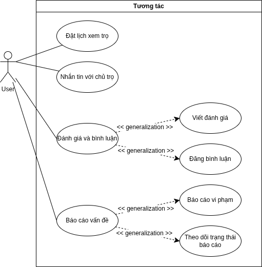

Hình 6: Use Case Diagram tương tác cơ bản với chủ trọ

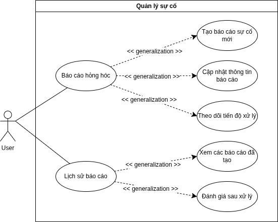

Hình 7: Use Case Diagram quản lý sự cố

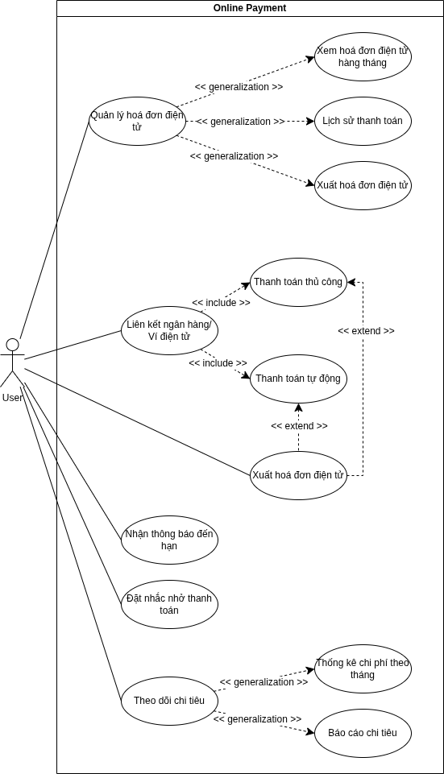

Hình 8: Use Case Diagram thanh toán trực tuyến

### 1.3. Quy trình nghiệp vụ

#### 1.3.1. Quy trình đặt phòng trọ

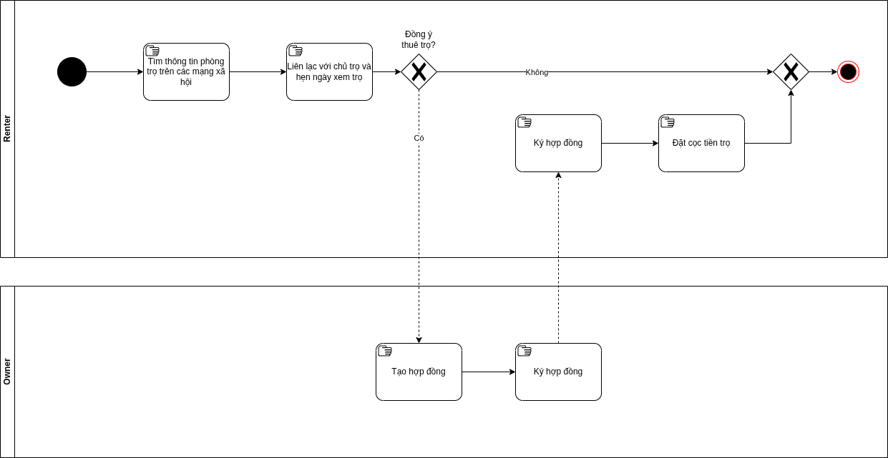

Hình 9: Quy trình đặt phòng trọ hiện tại

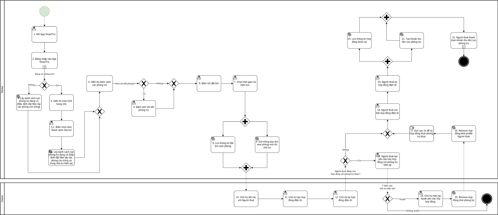

Hình 10: Quy trình đặt phòng trọ dự kiến

#### 1.3.2. Quy trình thanh toán

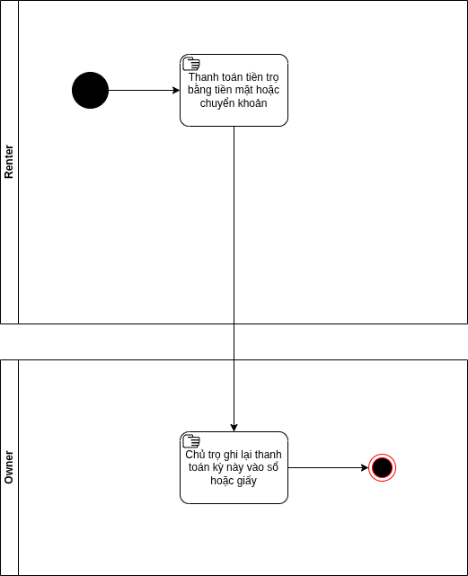

Hình 11: Quy trình thanh toán hiện tại

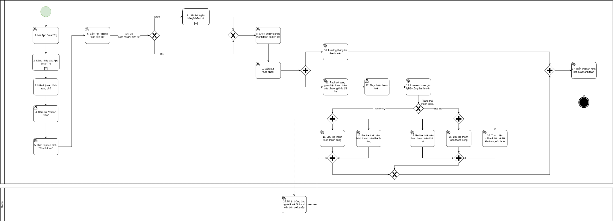

Hình 12: Quy trình thanh toán dự kiến

## 2. Chức năng sản phẩm

- Các chức năng được làm trong Phase 1 gồm 4 chức năng:

| STT | Tên chức năng | Mô tả tổng quan |
| --- | --- | --- |
| 1 | Đăng ký/Đăng nhập | Người dùng có thể đăng ký tài khoản, đăng nhập vào app |
| 2 | Tìm kiếm phòng trọ |  |
| 3 | Đặt lịch xem phòng trọ | Chọn phòng và đặt thời gian xem phòng phù hợp với thời gian trống của người thuê và chủ trọ |
| 4 | Nhắn tin | Người dùng có thể nhắn tin cho chủ trọ hoặc cho hệ thống |

- Các chức năng được làm trong Phase 2 gồm 4 chức năng:

| STT | Tên chức năng | Mô tả tổng quan |
| --- | --- | --- |
| 1 | Quản lý hồ sơ | Người dùng có thể quản lý thông tin cơ bản của tài khoản cũng như đổi mật khẩu |
| 2 | Báo cáo vi phạm | Người thuê có thể báo cáo bài đăng về phòng trọ vi phạm quy tắc của hệ thống hay có dấu hiệu lừa đảo với hệ thống và theo dõi trạng thái báo cáo |
| 3 | Báo cáo hỏng hóc | Người thuê có thể báo cáo hỏng hóc về trang thiết bị trong phòng trọ tới chủ trọ và theo dõi tiến độ xử lý |
| 4 | Lịch sử báo cáo (hỏng hóc) | Người thuê xem các báo cáo hỏng hóc đã tạo và đánh giá kết quả sau khi chủ trọ xử lý vấn đề |

- Các chức năng được làm trong Phase 3 gồm 3 chức năng:

| STT | Tên chức năng | Mô tả tổng quan |
| --- | --- | --- |
| 1 | Đánh giá và bình luận | Người thuê có thể đăng bình luận và viết đánh giá cho phòng trọ |
| 2 | Lưu phòng trọ và theo dõi phòng trọ | Người thuê có thể lưu phòng trọ vào danh sách yêu thích và sẽ nhận được thông báo về thông tin cập nhật về phòng trọ sớm nhất |
| 3 | Thanh toán trực tuyến | Chọn phòng và đặt thời gian xem phòng phù hợp với thời gian trống của người thuê và chủ trọ |

- Các chức năng được làm trong Phase 4 gồm 3 chức năng:

| STT | Tên chức năng | Mô tả tổng quan |
| --- | --- | --- |
| 1 | Quản lý hợp đồng điện tử | Người thuê có thể xem và ký hợp đồng điện tử |
| 2 | Quản lý hoá đơn | Người thuê có thể xem hoá đơn hàng tháng, lịch sử thanh toán và xuất hoá đơn điện tử |
| 3 | Theo dõi chi tiêu |  |

## 3. Phân tích các Use Case / Use cases analysis

### 3.1. Danh sách các use case

### 3.2. UC-1: Đăng ký bằng email

#### 3.2.1. Đặc tả use case

#### 3.2.2. Activity Diagram

### 3.3. UC-2: Đăng nhập bằng email và mật khẩu

#### 3.3.1. Đặc tả use case

#### 3.3.2. Activity Diagram

### 3.4. UC-3: Quên mật khẩu

#### 3.4.1. Đặc tả use case

| Thuộc tính | Nội dung |
| --- | --- |
| Tên use case | Quên mật khẩu bằng Email OTP |
| Tác nhân chính | Người thuê trọ |
| Kích hoạt | Người dùng chọn `Quên mật khẩu` tại màn Sign In |
| Tiền điều kiện | App có kết nối mạng; người dùng chưa đăng nhập; account recovery dùng email đã normalize |
| Hậu điều kiện thành công | Mật khẩu mới được lưu; toàn bộ access/refresh session cũ bị thu hồi; người dùng trở về Sign In với email prefill và không auto-login |
| Hậu điều kiện thất bại | Mật khẩu và session không thay đổi; không làm lộ email có account hay không |
| Baseline chi tiết | [`UC-03-forgot-password.md`](../../docs/use-cases/smarttro/UC-03-forgot-password.md) — Approved ngày 2026-09-23 |

**Luồng chính**

1. Hệ thống mở màn nhập Email riêng theo Figma node `2005:3286`.
2. Người dùng nhập email và chọn `Gửi OTP`.
3. Hệ thống trim + lowercase email, kiểm tra định dạng và áp dụng rate limit.
4. Hệ thống luôn trả message `Nếu email tồn tại, mã xác thực đã được gửi.`; nếu account đủ điều kiện, hệ thống phát hành challenge và gửi OTP email 6 chữ số.
5. App chuyển sang màn OTP riêng theo Figma node `2005:3261`; không thêm input OTP vào màn Email.
6. Người dùng nhập OTP. Khi OTP hợp lệ, server cấp reset token one-time-use TTL 10 phút.
7. App chuyển sang màn mật khẩu mới theo Figma node `2005:3310`.
8. Người dùng nhập và xác nhận mật khẩu mới theo password policy của UC-01.
9. Hệ thống cập nhật mật khẩu, thu hồi toàn bộ session cũ và ghi audit đã mask dữ liệu nhạy cảm.
10. App chuyển về Sign In với email prefill và thông báo thành công; không auto-login.

**Luồng thay thế và ngoại lệ**

- Email sai định dạng: không gửi request; hiển thị validation tại field.
- Email không tồn tại, chưa verify hoặc social-only: vẫn dùng response trung tính; không tự tạo hoặc tự link account.
- Resend trước 60 giây: không phát hành OTP mới. Resend hợp lệ làm OTP cũ vô hiệu.
- OTP sai: tăng attempt counter; tối đa 5 lần/challenge. OTP sai, hết hạn, replay hoặc đã bị thay thế không được chuyển bước.
- Rate limit: tối đa 5 request/15 phút/email và 20 request/giờ/IP, kết hợp tín hiệu device; response không làm lộ account existence.
- Reset token hết hạn/replay/sai binding: không đổi mật khẩu và yêu cầu bắt đầu lại theo flow phù hợp.
- Lỗi mạng: chống double-submit; không persist OTP/password/reset token.
- App chỉ background và process còn sống: giữ bước trong memory nếu challenge/reset token còn hạn; luôn xóa password fields khi resume.
- App bị force-close/process bị kill hoặc mở lại sau restart: xóa toàn bộ recovery state, mở Sign In; người dùng phải bắt đầu lại từ email và nhận OTP mới.

**Quy tắc bảo mật**

- OTP gồm 6 chữ số, TTL 10 phút.
- Reset token TTL 10 phút, one-time-use và bind với account + challenge + context phù hợp.
- Không log hoặc truyền OTP/password/reset token qua analytics hay route parameters.
- Không persist email, OTP, challenge, password hoặc reset token của recovery qua app restart.
- Audit các sự kiện request/resend/verify/reset/revoke bằng immutable user ID và email đã mask.

#### 3.4.2. Activity Diagram

- Source: [`AD_Forgot Password.puml`](../../Activity_Diagrams/AD_Forgot%20Password.puml)
- Render: [`AD_Forgot Password.png`](../../Activity_Diagrams/AD_Forgot%20Password.png)

### 3.5. UC-4: Xem thông tin cá nhân

#### 3.5.1. Đặc tả use case

#### 3.5.2. Activity Diagram

### 3.6. UC-5: Cập nhật thông tin cá nhân

#### 3.6.1. Đặc tả use case

#### 3.6.2. Activity Diagram

### 3.7. UC-6: Đổi mật khẩu

#### 3.7.1. Đặc tả use case

#### 3.7.2. Activity Diagram

### 3.8. UC-7: Xem hợp đồng điện tử

#### 3.8.1. Đặc tả use case

#### 3.8.2. Activity Diagram

### 3.9. UC-8: Ký hợp đồng điện tử

#### 3.9.1. Đặc tả use case

#### 3.9.2. Activity Diagram

### 3.10. UC-9: Hủy hợp đồng điện tử

#### 3.10.1. Đặc tả use case

#### 3.10.2. Activity Diagram

### 3.11. UC-10: Xem danh sách phòng trọ

#### 3.11.1. Đặc tả use case

#### 3.11.2. Activity Diagram

### 3.12. UC-11: Xem chi tiết phòng trọ

#### 3.12.1. Đặc tả use case

#### 3.12.2. Activity Diagram

### 3.13. UC-12: Đánh giá và bình luận trong bài đăng về phòng trọ

#### 3.13.1. Đặc tả use case

#### 3.13.2. Activity Diagram

### 3.14. UC-13: Lưu phòng trọ yêu thích

#### 3.14.1. Đặc tả use case

#### 3.14.2. Activity Diagram

### 3.15. UC-14: Đặt lịch xem trọ

#### 3.15.1. Đặc tả use case

#### 3.15.2. Activity Diagram

### 3.16. UC-15: Nhắn tin với chủ trọ

#### 3.16.1. Đặc tả use case

#### 3.16.2. Activity Diagram

### 3.17. UC-16: Viết đánh giá về nhà trọ

#### 3.17.1. Đặc tả use case

#### 3.17.2. Activity Diagram

### 3.18. UC-17: Báo cáo vi phạm

#### 3.18.1. Đặc tả use case

#### 3.18.2. Activity Diagram

### 3.19. UC-18: Xem các báo cáo đã tạo

#### 3.19.1. Đặc tả use case

#### 3.19.2. Activity Diagram

### 3.20. UC-19: Tạo báo cáo sự cố

#### 3.20.1. Đặc tả use case

#### 3.20.2. Activity Diagram

### 3.21. UC-20: Theo dõi tiến độ xử lý

#### 3.21.1. Đặc tả use case

#### 3.21.2. Activity Diagram

### 3.22. UC-21: Cập nhật thông tin báo cáo

#### 3.22.1. Đặc tả use case

#### 3.22.2. Activity Diagram

### 3.23. UC-22: Đánh giá sau xử lý

#### 3.23.1. Đặc tả use case

#### 3.23.2. Activity Diagram

### 3.24. UC-23: Liên kết ngân hàng/ví điện tử

#### 3.24.1. Đặc tả use case

#### 3.24.2. Activity Diagram

### 3.25. UC-24: Thanh toán thủ công

#### 3.25.1. Đặc tả use case

#### 3.25.2. Activity Diagram

### 3.26. UC-25: Thanh toán tự động

#### 3.26.1. Đặc tả use case

#### 3.26.2. Activity Diagram

### 3.27. UC-26: Nhận thông báo đến hạn

#### 3.27.1. Đặc tả use case

#### 3.27.2. Activity Diagram

### 3.28. UC-27: Đặt nhắc nhở thanh toán

#### 3.28.1. Đặc tả use case

#### 3.28.2. Activity Diagram

### 3.29. UC-28: Xem lịch sử thanh toán

#### 3.29.1. Đặc tả use case

#### 3.29.2. Activity Diagram

### 3.30. UC-29: Xuất hóa đơn điện tử

#### 3.30.1. Đặc tả use case

#### 3.30.2. Activity Diagram

### 3.31. UC-30: Thống kê chi phí theo tháng

#### 3.31.1. Đặc tả use case

#### 3.31.2. Activity Diagram

### 3.32. UC-31: Báo cáo chi tiêu

#### 3.32.1. Đặc tả use case

#### 3.32.2. Activity Diagram

## 4. Môi trường hoạt động / Operating Environment

- Phần cứng:

- Máy chủ: Ứng dụng có thể được triển khai trên các máy chủ vật lý hoặc máy chủ ảo (cloud server) với cấu hình phù hợp với số lượng người dùng và lưu lượng truy cập.

- Thiết bị truy cập: Ứng dụng tương thích với các thiết bị di động như: Điện thoại thông minh (smartphone) hệ điều hành IOS và Android, Máy tính bảng (tablet)

- Phần mềm:

- Hệ điều hành: Ứng dụng tương thích với các hệ điều hành di động phổ biến hiện nay: iOS, Android.

- Phần mềm liên quan: Ứng dụng có khả năng tích hợp với hệ thống thanh toán hiện có thông qua API, Cổng thanh toán trực tuyến (Momo, VNPay, thẻ quốc tế) và Hoá đơn điện tử (BKAV)

- Môi trường mạng:

- Ứng dụng chỉ có thể hoạt động trong môi trường internet.

- Ứng dụng được thiết kế để hoạt động hiệu quả trong các điều kiện kết nối mạng khác nhau, bao gồm cả kết nối internet tốc độ cao và kết nối internet di động (3G/4G/5G).

## 5. Ràng buộc thiết kế & triển khai / Design and Implementation Constraints

## 5.1 Chính sách & Quy định

- Tuân thủ Nghị định 13/2023 về bảo vệ dữ liệu cá nhân tại Việt Nam.

- Thông tin nhạy cảm của người dùng như mật khẩu và thông tin thanh toán phải được mã hóa bằng chuẩn AES256.

- Hệ thống phải tuân thủ quy định của Ngân hàng Nhà nước Việt Nam về thanh toán trực tuyến.

## 5.2 Kiến trúc & Công nghệ

- Giao diện responsive phù hợp với mọi kích thước màn hình thiết bị.

- Ưu tiên sử dụng framework phổ biến như ReactJS/Angular cho frontend và Laravel/Spring/Node.js/Django cho backend.

- Hệ quản trị cơ sở dữ liệu: PostgreSQL và MongoDB để hỗ trợ khả năng mở rộng.

## 5.3 Yêu cầu bảo mật

- Sử dụng xác thực hai yếu tố (2FA) cho tài khoản người dùng.

- Ngăn chặn các cuộc tấn công mạng phổ biến như SQL Injection và Cross-Site Scripting (XSS).

- Sao lưu dữ liệu định kỳ hàng ngày để đảm bảo phục hồi khi xảy ra sự cố.

## 6. Tài liệu cho Người dùng / User Documentation

## 6.1 Hướng dẫn sử dụng

Cung cấp tài liệu chi tiết về cách:

- Đăng ký tài khoản mới và đăng nhập vào ứng dụng.

- Tạo chữ ký điện tử và cách thuê trọ an toàn.

- Thực hiện thanh toán trực tuyến trên app.

- Sử dụng Thống kê chi phí và Báo cáo chi tiêu để quản lý thu chi cá nhân.

## 6.2 FAQ và Trợ giúp trực tuyến

Bao gồm các câu hỏi thường gặp như:

- Làm thế nào để khôi phục mật khẩu?

- Làm thế nào để thuê trọ an toàn?

- Thanh toán trên nền tảng có bị mất thêm phí không?

## 6.3 Tài liệu tham khảo API

Dành cho nhà phát triển muốn tích hợp ứng dụng với hệ thống bên thứ ba:

- API thanh toán trực tuyến (Momo, ZaloPay).

- API xuất hóa đơn (BKAV).

# III. Yêu cầu giao diện / Interface Requirements

## 1. 1. Giao diện phần mềm (Software Interfaces)

## Mô tả:

- Giao diện người dùng cần được thiết kế hiện đại, thân thiện, dễ sử dụng và trực quan.

- Phù hợp với cả nền tảng web và ứng dụng di động (iOS, Android).

- Sử dụng màu sắc hài hòa, biểu tượng rõ ràng, và bố cục hợp lý để tối ưu trải nghiệm người dùng.

## Chức năng chính:

- Trang chủ: Hiển thị danh mục sản phẩm, sản phẩm nổi bật, và các chương trình khuyến mãi.

- Tìm kiếm: Thanh tìm kiếm cho phép lọc sản phẩm theo danh mục, giá cả, tình trạng.

- Quản lý tài khoản: Hiển thị thông tin cá nhân, lịch sử giao dịch, và điểm tích lũy.

- Trang loyalty program: Hiển thị số điểm hiện tại, cấp bậc thành viên (Basic, Silver, Gold), và danh sách voucher có thể đổi.

- Trang chi tiết sản phẩm: Hiển thị hình ảnh sản phẩm, mô tả chi tiết, giá cả, tình trạng còn hàng.

- Trang thanh toán: Giao diện đơn giản với các tùy chọn thanh toán như ví điện tử hoặc thẻ ngân hàng.

## Tiêu chuẩn UI/UX:

- Tuân theo các nguyên tắc thiết kế UI/UX hiện đại như Material Design (Google) hoặc Human Interface Guidelines (Apple).

- Tối ưu hóa trải nghiệm người dùng với luồng thao tác rõ ràng và dễ hiểu.

- Hỗ trợ responsive design để giao diện tự điều chỉnh phù hợp với kích thước màn hình của thiết bị.

## API và giao thức:

- Hỗ trợ kết nối API RESTful để tích hợp với hệ thống thanh toán trực tuyến (Momo, ZaloPay).

- Sử dụng giao thức HTTPS để đảm bảo an toàn khi truyền tải dữ liệu giữa ứng dụng và máy chủ.

## 2. Giao diện thiết bị ngoại vi (Hardware Interfaces)

## Mô tả:

## Ứng dụng VIS có khả năng tương tác với một số thiết bị ngoại vi để tăng cường trải nghiệm người dùng.

## Chức năng chính:

- Máy in:

- Hỗ trợ in hóa đơn hoặc phiếu xác nhận giao dịch nếu cần.

- Kết nối qua Bluetooth hoặc mạng nội bộ.

- Camera:

- Cho phép người dùng chụp ảnh sản phẩm khi đăng bán hoặc trao đổi hàng hóa.

- Hỗ trợ tải lên hình ảnh từ thư viện của thiết bị.

- GPS:

- Sử dụng GPS trên điện thoại thông minh để xác định vị trí của người dùng.

- Hỗ trợ hiển thị bản đồ để tìm kiếm đối tác gần nhất trong trường hợp trao đổi hàng hóa.

## Tiêu chuẩn kết nối:

- Bluetooth: Kết nối với máy in hoặc các thiết bị ngoại vi khác.

- API hệ điều hành (iOS/Android): Tích hợp camera và GPS của thiết bị di động.

## 3. Giao diện truyền thông (Communication Interfaces)

## Mô tả:

## Ứng dụng VIS hỗ trợ đa dạng các kênh truyền thông để tương tác với người dùng và hệ thống bên thứ ba.

## Chức năng chính:

- Email:

- Gửi mã OTP 6 chữ số qua email để xác minh quyền sở hữu email khi đăng ký tài khoản.

- Thông báo trạng thái giao dịch (thành công/thất bại).

- Gửi thông tin khuyến mãi hoặc voucher từ loyalty program.

- SMS:

- SMS không được dùng để xác thực Sign Up hoặc Sign In trong MVP; chỉ sử dụng cho thông báo hoặc giao dịch khi requirement tương ứng được phê duyệt.

- Thông báo ngắn gọn về trạng thái giao dịch nếu người dùng không truy cập ứng dụng.

- Thông báo trong ứng dụng (Push Notifications):

- Cập nhật trạng thái đơn hàng.

- Thông báo về chương trình khuyến mãi hoặc điểm thưởng sắp hết hạn.

- Nhắc nhở về các giao dịch đang chờ xử lý.

- Kết nối mạng:

- Truy cập dữ liệu từ xa qua mạng internet với tốc độ nhanh chóng và ổn định.

- Đồng bộ hóa dữ liệu giữa máy chủ và ứng dụng theo thời gian thực.

## Tiêu chuẩn bảo mật và giao thức:

- Sử dụng giao thức HTTPS để bảo mật dữ liệu khi truyền tải thông tin giữa ứng dụng và máy chủ.

- Tuân thủ các tiêu chuẩn bảo mật dữ liệu như SSL/TLS để mã hóa dữ liệu nhạy cảm.

- Đảm bảo tuân thủ Nghị định 13/2023 về bảo vệ dữ liệu cá nhân tại Việt Nam.

# IV. Tính năng hệ thống / System Features

## 1. Chức năng FR01: Quyên góp và trao đổi hàng hoá

### 1.1. Mô tả và Ưu tiên & Đánh giá độ ưu tiên / Description and Priority

| Chức năng | Mô tả | Đánh giá | Độ ưu tiên |
| --- | --- | --- | --- |
| FR01: Quyên góp và trao đổi hàng hoá | Người dùng có thể đăng ký quyên góp hoặc trao đổi sản phẩm thời trang trên nền tảng. Quy trình trao đổi được thực hiện thông qua hệ thống quản lý minh bạch, giúp người dùng dễ dàng kết nối với đối tác trao đổi. | Chức năng cốt lõi, cần được ưu tiên phát triển | Cao |

### 1.2. Tương tác & Phản hồi hệ thống / Stimulus-Response Sequences

- Người dùng chọn tính năng "Quyên góp" hoặc "Trao đổi".

- Hệ thống hiển thị danh sách sản phẩm để trao đổi hoặc thông tin tổ chức nhận quyên góp.

- Người dùng chọn sản phẩm muốn trao đổi hoặc đăng ký quyên góp.

- Hệ thống kiểm tra thông tin sản phẩm và xác nhận giao dịch.

- Với trao đổi:

- Hệ thống kết nối người dùng với đối tác trao đổi phù hợp.

- Gửi thông báo trạng thái giao dịch (đang xử lý, hoàn tất).

- Với quyên góp:

### 1.3. Yêu cầu chức năng / Functional Requirements

- Hệ thống phải cho phép người dùng đăng ký sản phẩm để trao đổi hoặc quyên góp.

- Hệ thống phải hỗ trợ kết nối người dùng với đối tác phù hợp trong trường hợp trao đổi.

- Hệ thống cần lưu trữ lịch sử quyên góp và trao đổi của người dùng.

## 2. Chức năng FR02: Quản lý giao dịch

### 2.1. Mô tả và Ưu tiên & Đánh giá độ ưu tiên / Description and Priority

| Chức năng | Mô tả | Đánh giá | Độ ưu tiên |
| --- | --- | --- | --- |
| FR02: Quản lý giao dịch | Quản lý toàn bộ quy trình giao dịch từ đặt hàng, thanh toán đến theo dõi lịch sử giao dịch của người dùng. | Chức năng quan trọng | Cao |

### 2.2. Tương tác & Phản hồi hệ thống / Stimulus-Response Sequences

- Người mua chọn sản phẩm để đặt hàng.

- Hệ thống hiển thị thông tin chi tiết sản phẩm (giá, tình trạng, mô tả).

- Người mua thêm sản phẩm vào giỏ hàng và xác nhận đơn hàng.

- Hệ thống chuyển đến cổng thanh toán tích hợp (ví điện tử, thẻ ngân hàng).

- Sau khi thanh toán thành công:

- Cập nhật trạng thái đơn hàng thành "Đã thanh toán".

- Gửi email hoặc thông báo xác nhận giao dịch.

### 2.3. Yêu cầu chức năng / Functional Requirements

- Hệ thống phải hỗ trợ thanh toán trực tuyến an toàn qua các cổng thanh toán tích hợp.

- Hệ thống phải gửi thông báo trạng thái giao dịch qua email hoặc ứng dụng.

## 3. Chức năng FR03: Loyalty program

### 3.1. Mô tả và Ưu tiên & Đánh giá độ ưu tiên / Description and Priority

| Chức năng | Mô tả | Đánh giá | Độ ưu tiên |
| --- | --- | --- | --- |
| FR03: Loyalty Program | Chương trình tích điểm thưởng cho người dùng dựa trên các hoạt động như mua bán, trao đổi hoặc quyên góp sản phẩm. | Chức năng nâng cao, tăng tính hấp dẫn và tương tác. | Cao |

### 3.2. Tương tác & Phản hồi hệ thống / Stimulus-Response Sequences

#### 3.2.1. Tạo thách đấu

- Người dùng thực hiện giao dịch thành công (mua bán, quyên góp, trao đổi).

- Hệ thống tự động tính điểm thưởng dựa trên giá trị giao dịch (10 điểm cho mỗi 100.000 VNĐ).

- Điểm tích lũy được hiển thị trong tài khoản cá nhân của người dùng.

- Người dùng truy cập trang loyalty program để xem danh sách voucher có thể đổi bằng điểm thưởng.

- Người dùng chọn voucher và xác nhận đổi thưởng.

- Hệ thống gửi mã voucher qua email hoặc ứng dụng.

### 3.3. Yêu cầu chức năng / Functional Requirements

- Hệ thống phải tự động tính điểm thưởng cho mỗi giao dịch thành công.

- Hệ thống cần hiển thị cấp bậc thành viên dựa trên số điểm tích lũy (Basic, Silver, Gold).

- Hệ thống phải cho phép người dùng đổi điểm lấy voucher từ các thương hiệu đối tác.

## 4. Chức năng FR04: Quản lý tài khoản

### 5.1. Mô tả và Ưu tiên & Đánh giá độ ưu tiên / Description and Priority

| Chức năng | Mô tả | Đánh giá | Độ ưu tiên |
| --- | --- | --- | --- |
| FR05: Quản lý tài khoản | Quản lý thông tin cá nhân, phương thức thanh toán, và lịch sử hoạt động của người dùng trên nền tảng | Chức năng cơ bản, cần được ưu tiên phát triển. | Cao |

### 5.2. Tương tác & Phản hồi hệ thống / Stimulus-Response Sequences

- Người dùng đăng ký tài khoản mới bằng email và xác minh bằng mã OTP 6 chữ số gửi qua email. Email đã chuẩn hóa là định danh đăng nhập unique trong MVP; số điện thoại chỉ là dữ liệu liên hệ tùy chọn.

- Sau khi đăng nhập, người dùng truy cập trang "Tài khoản của tôi" để:

- Xem và chỉnh sửa thông tin cá nhân (tên, ảnh đại diện, địa chỉ liên lạc).

- Xem lịch sử giao dịch (mua bán, quyên góp, trao đổi).

- Quản lý phương thức thanh toán (thêm/xóa thẻ ngân hàng hoặc ví điện tử).

- Người dùng có thể thay đổi mật khẩu hoặc khôi phục mật khẩu nếu quên.

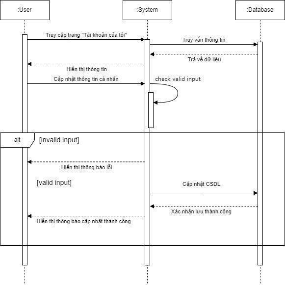

### 5.3. Yêu cầu chức năng / Functional Requirements

- Hệ thống phải đảm bảo tính bảo mật cho tài khoản người dùng bằng cách:

- Email đã xác minh và mật khẩu hợp lệ; không yêu cầu OTP khi Sign In.

- Cung cấp tùy chọn xác thực hai yếu tố (2FA) để tăng cường bảo mật.

- Cho phép người dùng thay đổi mật khẩu định kỳ.

- Hệ thống cho phép người dùng xem và chỉnh sửa thông tin cá nhân: Họ tên, Số điện thoại, Email, Giới tính, Ngày sinh, Ảnh đại diện)

- Hệ thống cần kiểm tra tính hợp lệ của thông tin được cập nhật (ví dụ: định dạng email, số điện thoại,...).

- Hệ thống hiển thị lịch sử hoạt động của người dùng trên ứng dụng

- Hệ thống cho phép người dùng xem lịch sử giao dịch thanh toán

- Hệ thống cho phép người dùng thêm, xóa, cập nhật thông tin về phương thức thanh toán (thẻ ngân hàng, ví điện tử,...).

- Hệ thống cần đảm bảo bảo mật thông tin thanh toán của người dùng.

- Hệ thống cung cấp danh sách các loại thông báo và cho phép người dùng bật/tắt từng loại.

- Hệ thống cung cấp đường dẫn/ liên kết đến các chính sách, điều khoản dịch vụ của ứng dụng.

- Hệ thống cho phép người dùng liên hệ với bộ phận hỗ trợ của ứng dụng (ví dụ: qua email, hotline, chat trực tuyến) để được giải đáp thắc mắc, báo cáo lỗi hoặc đóng góp ý kiến.

# V. Các Yêu Cầu Phi Chức Năng / Non-functional requirements

## 1. Hiệu suất

- Tốc độ phản hồi:

- Thời gian phản hồi cho các thao tác người dùng (tìm kiếm, giao dịch, thanh toán...) phải nhỏ hơn 1 giây.

- Thời gian tải trang chủ không quá 2 giây.

- Khả năng chịu tải:

- Ứng dụng cần xử lý được ít nhất 5000 người dùng truy cập đồng thời mà vẫn đảm bảo hiệu suất.

- Hệ thống có khả năng mở rộng dễ dàng để đáp ứng số lượng người dùng tăng cao hơn trong tương lai.

- Độ ổn định:

- Thời gian hoạt động của ứng dụng phải đạt ít nhất 99.9%.

- Ứng dụng cần có khả năng tự động phục hồi sau sự cố trong vòng không quá 15 phút.

- Cập nhật tình hàng hoá: Hệ thống sẽ kiểm tra và cập nhật tình trạng hàng hoá liên tục (tồn kho / số lượng) mỗi 1 phút một lần. Thông tin hiển thị trên ứng dụng phải phản ánh chính xác tình trạng hàng theo thời gian thực.

## 2. Bảo mật

- Bảo mật dữ liệu:

- Ứng dụng sẽ mã hóa tất cả các thông tin nhạy cảm của người dùng (thông tin tài khoản, thông tin thanh toán, lịch sử đặt sân) bằng giao thức HTTPS.

- Dữ liệu người dùng sẽ được lưu trữ an toàn và tuân thủ các tiêu chuẩn bảo mật như GDPR, CCPA.

- Chống gian lận: Ứng dụng sẽ được tích hợp các biện pháp chống gian lận như xác thực hai yếu tố (2FA), phát hiện và ngăn chặn các giao dịch đáng ngờ.

- Kiểm soát truy cập: Ứng dụng phân quyền truy cập chi tiết cho từng vai trò người dùng (khách hàng, quản trị viên sân, quản trị viên hệ thống) để đảm bảo chỉ người dùng được cấp phép mới có thể truy cập vào thông tin và chức năng tương ứng.

## 4. Khả năng sử dụng

- Giao diện thân thiện: Ứng dụng có giao diện đơn giản, dễ hiểu, dễ sử dụng trên ứng dụng di động.

- Hỗ trợ người dùng: Ứng dụng cung cấp đầy đủ hướng dẫn sử dụng, FAQs và tích hợp tính năng chat trực tuyến để hỗ trợ người dùng nhanh chóng và hiệu quả.

- Tương thích đa nền tảng: Ứng dụng tương thích với các thiết bị di động phổ biến (iOS, Android)

- Đa ngôn ngữ: Ứng dụng hỗ trợ 2 ngôn ngữ: Tiếng Việt và Tiếng Anh.

## 5. Khả năng bảo trì

- Cấu trúc mã nguồn: Ứng dụng được phát triển với mã nguồn rõ ràng, dễ hiểu, dễ bảo trì và mở rộng.

- Tài liệu: Cung cấp đầy đủ tài liệu hướng dẫn sử dụng, tài liệu kỹ thuật và tài liệu API để hỗ trợ việc vận hành, bảo trì và phát triển thêm tính năng cho ứng dụng.

## 6. Khả năng mở rộng

- Tích hợp hệ thống: Ứng dụng có khả năng tích hợp với các hệ thống khác như:

- Hệ thống thanh toán trực tuyến (Momo, VNPay, thẻ quốc tế).

- Hệ thống vận chuyển logistics (Nếu có)
